```{css, echo=FALSE, eval=TRUE}
pre code {
white-space: pre !important;
overflow-x: scroll !important;
word-break: keep-all !important;
word-wrap: initial !important;
}
```

```{r style, echo = FALSE, results = 'asis', eval=TRUE}
options(width=80, max.print=1000)
knitr::opts_chunk$set(
    eval=as.logical(Sys.getenv("KNITR_EVAL", "TRUE")),
    cache=as.logical(Sys.getenv("KNITR_CACHE", "TRUE")), 
    tidy.opts=list(width.cutoff=60), 
    tidy=TRUE,
    eval = FALSE)
# shiny::tagList(rmarkdown::html_dependency_font_awesome())
```

```{r setup, echo=FALSE, messages=FALSE, warnings=FALSE, eval=TRUE}
    suppressPackageStartupMessages(library(systemPipeShiny))
```

```{r sps-css, results = 'asis', echo=FALSE, eval=TRUE}
cat("<style>")
cat(readLines(system.file("app/www/css/sps.css", package = "systemPipeShiny")),sep = "\n")
cat("</style>")
```

```{r logo, echo=FALSE, out.width='70%', fig.align='center', eval=TRUE}
knitr::include_graphics(path = "../inst/app/www/img/sps.png")
```

# Introduction

**<span style="color:#5DA7D6;">s</span>ystem<span
style="color:#5DA7D6;">P</span>ipe<span style="color:#5DA7D6;">S</span>hiny**
(SPS) extends the widely used [systemPipeR](https://bioconductor.org/packages/systemPipeR/) 
(SPR) workflow
environment with a versatile graphical user interface provided by a [Shiny
App](https://shiny.rstudio.com). This allows non-R users, such as
experimentalists, to run many systemPipeR's workflow designs, control, and
visualization functionalities interactively without requiring knowledge of R.
Most importantly, `SPS` has been designed as a general purpose framework for
interacting with other R packages in an intuitive manner. Like most Shiny Apps,
SPS can be used on both local computers as well as centralized server-based
deployments that can be accessed remotely as a public web service for using
SPR's functionalities with community and/or private data. The framework can
integrate many core packages from the R/Bioconductor ecosystem. Examples of
SPS' current functionalities include: (a) interactive creation of experimental
designs and metadata using an easy to use tabular editor or file uploader; (b)
visualization of workflow topologies combined with auto-generation of R
Markdown preview for interactively designed workflows; (c) access to a wide
range of data processing routines; (d) and an extendable set of visualization
functionalities. Complex visual results can be managed on a 'Canvas Workbench'
allowing users to organize and to compare plots in an efficient manner combined
with a session snapshot feature to continue work at a later time. The present
suite of pre-configured visualization examples include different methods to
plot a count table. The modular design of 
SPR makes it easy to design custom functions without any knowledge of Shiny, 
as well as extending the environment in the future with contributions from 
the community.

An example web instance for testing `SPS` online is available
[here](https://tgirke.shinyapps.io/systemPipeShiny/){target="_blank"}. At the
time of writing, there are five interactive tutorials embedded in this instance
that users can access from the upper-right corner. Each tutorial introduces 
major functionalities of SPS.

# Installation

The `systemPipeShiny` package can be installed from a user's R console as follows.

```{r, eval=FALSE}
if (!requireNamespace("BiocManager", quietly=TRUE))
    install.packages("BiocManager")
BiocManager::install("systemPipeShiny")

# or use "pak"
if (!requireNamespace("pak", quietly=TRUE))
    install.packages("pak", repos = "https://r-lib.github.io/p/pak/dev/")
pak::pkg_install("systemPipeShiny")

```

If the user's OS is Linux then one may need to install the following dependencies 
**before** installing SPS.
The following example applies to Ubuntu.

```{bash, eval=FALSE}
sudo apt-get install -y libcurl4-openssl-dev
sudo apt-get install -y libssl-dev
sudo apt-get install -y libv8-dev
# other dependencies
sudo apt-get install -y libicu-dev
sudo apt-get install -y pandoc
sudo apt-get install -y make
sudo apt-get install -y libglpk-dev
sudo apt-get install -y libgmp3-dev
sudo apt-get install -y zlib1g-dev
```

Most likely you only need to install first 3, *libcurl4-openssl-dev* may not be 
required for Ubuntu > 18.04. In case any other problem happens, try to install 
other system dependencies.

On other Linux distributions, the install commands may be slightly different. 

# Main functionalities 

Currently, `SPS` includes 3 main functional categories (*Fig 1*): 

 1. Some pre-defined modules include: 
    a. A workbench for designing and configuring data analysis workflows, 
    b. Downstream analysis and visualization tools for RNA-Seq, and 
    c. A space to make quick ggplots. 
 2. A section with user custom tabs: users define their own shiny tabs.  
 3. An image editing tab "Canvas" which allows users to edit plots made from 
    the previous two categories. 

Besides, SPS provides many functions to extend the default Shiny development, like 
more UI components, server functions. Also, SPS has some useful general R ulitlies
like error catching, logging, and more. 

<center id="sps_structure">
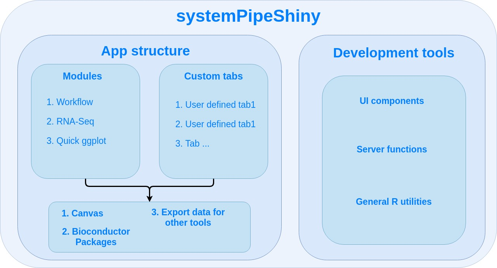
</center>
**Figure 1.** Design of `systemPipeShiny.` 

The framework provides an
interactive web interface for workflow management and data visualization.

Within the functional categories, `SPS` functions are modularized in
sub-components, here referred to as **SPS tabs** that are similar to 
menu tabs in other GUI applications that organize related and inter-connected 
functionalies into groups. On the backend, **SPS tabs** are based on [Shiny modules](https://shiny.rstudio.com/articles/modules.html), 
that are stored in separate files. This modular structure is highly extensible 
and greatly simplifies the design of new `SPS` tabs by both users and/or developers. 
Details about extending existing tabs and designing new ones are provided in 
[advanced sections on our website](https://systempipe.org/sps/). 

# SPS example usage

The following instructions go through use each module step by step.

Please read our website: <https://systempipe.org/sps/> for full instructions, 
animations, videos, and advanced sections. 

## Load package

Load the `systemPipeShiny` package in your R session.

```{r sps_load_package, eval=TRUE}
library(systemPipeShiny)
```

## Initialize `SPS` project

Before launching the `SPS` application, a project environment needs to be created with the
following command.

```{r spsinit, eval=FALSE}
spsInit()
```

For this toy example, the project directory structure is written to a temporary
directory on a user's system. For a real project, it should be written to a
defined and user controlled location on a system rather than a temporary
directory.

```{r spsinit_temp, eval=TRUE}
sps_tmp_dir <- tempdir()
spsInit(app_path = sps_tmp_dir, change_wd = FALSE, project_name = "SPSProject")
sps_dir <- file.path(sps_tmp_dir, "SPSProject")
```

### SPS project structure

The file and directory structure of an SPS project is organized as follows. 

<pre>
SPS_xx/  
├── server.R               <span class="text-success">|</span> 
├── global.R               <span class="text-success">| Most important server, UI and global files, unless special needs, `global.R` is the only file you need to edit manually</span>   
├── ui.R                   <span class="text-success">|</span>  
├── deploy.R               <span class="text-info">| Deploy helper file</span>  
├── config                 <span class="text-success">| Important app config files. Do not edit them if you don't know</span>  
│   ├── sps.db             <span class="text-gray">| SPS database</span> 
│   ├── sps_options.yaml   <span class="text-gray">| SPS default option list</span> 
│   └── tabs.csv           <span class="text-gray">| SPS tab information</span> 
├── data                   <span class="text-primary">| App example data files</span> 
│   ├── xx.csv             
├── R                      <span class="text-primary">| All SPS additional tab files and helper R function files</span> 
│   ├── tab_xx.R            
├── README.md              
├── results                <span class="text-gray">| Not in use for this current version, you can store some data been generated from the app</span> 
│   └── README.md          
└── www                    <span class="text-primary">| Internet resources</span>  
    ├── about              <span class="text-gray">| About tab information</span> 
    │   └── xx.md          
    ├── css                <span class="text-info">| CSS files</span>  
    │   └── sps.css         
    ├── img                <span class="text-info">| App image resources</span>    
    │   └── xx.png         
    ├── js                 <span class="text-info">| Javascripts</span>
    │   └── xx.js           
    ├── loading_themes     <span class="text-info">| Loading screen files</span> 
    │   └── xx.html         
    └── plot_list          <span class="text-info">| Image files for plot gallery</span>  
        └── plot_xx.jpg      
</pre>

## Launch `SPS` 

By default, the working directory will be set inside the project folder automatically. 
To launch the `SPS` Shiny application, one only needs to execute the following command.

```{r, eval=FALSE}
shiny::runApp()
```

After the SPS app has been launched, clicking the "Continue to app" button
on the welcome screen will open the main dashboard (Fig.2).


<center id="sps_ui">

</center>
**Figure 2:** Snapshot of SPS' UI.

1. Welcome screen.
2. Module tabs.
3. User defined custom tabs.
4. The Canvas tab.
5. All SPS tabs has this description on top. It is highly recommend to click here 
   to expand and read the full the description for the first time.

Alternatively, when using RStudio one can click the `Run App` button in the top right corner.

In addition, in Rstudio the *global.R* file will be automatically
opened when the `SPS` project is created. Custom changes can be made inside this file
before the app launches. The [advanced section](#extend-sps) explains how
to change and create new custom tabs. 

## Workflow management

The workflow management module in `SPS` allows one to modify or create the
configuration files required for running data analysis workflows in
[systemPipeR](https://systempipe.org/docs/systemPipeR/) (SPR). This includes
three types of important files: a sample metadata (targets) file, a
workflow file (in R Markdown format) defining the workflow steps, and workflow running 
files in [Common Workflow Language (CWL)](https://www.commonwl.org/) format. In SPS, one can easily create
these files under the "Workflow Management" module, located in navigation bar
on the left of the dashboard (Fig2 - 2). 

The current version of `SPS` allows to:

1. create a workflow environment;
2. create and/or check the format of targets / workflow / CWL files;
3. download the prepared workflow files to run elsewhere, like a cluster;
4. directly execute the workflow from SPS.


### 1. setup a workflow 
<center>
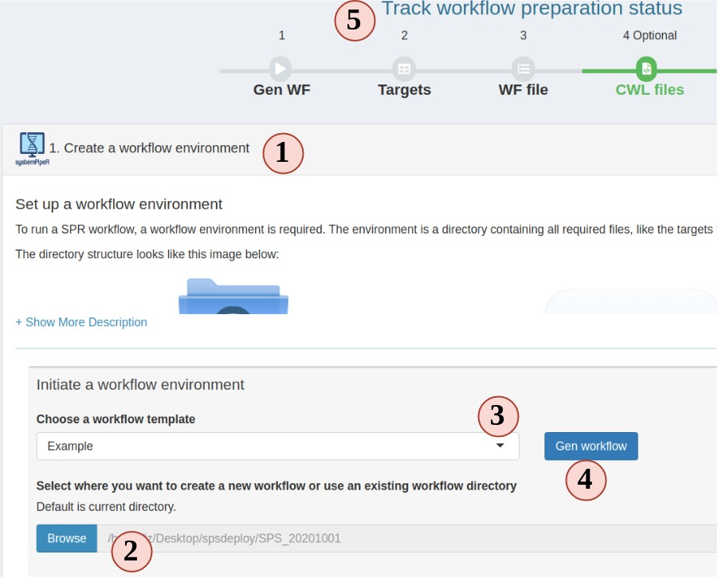
</center>
**Figure 3. A.** Workflow Management - Targets File

1. In the workflow module, read the instructions and choose step 1. Step 1 should be 
automatically opened for you on start.
2. Choose a folder where you want to create the workflow environment.
3. Choose a workflow template. These are SPR workflows and mainly are next-generation 
sequencing workflows. 
4. Click "Gen workflow" to create the workflow project. 
5. You should see a pop-up saying about the project path and other information. 
Clicking the pop-up will jump you to the step 2. The status tracker and banner for 
step 1 should all turn green. 


### 2. Prepare a target file

The targets file defines all input file paths and other sample information of
analysis workflows. To better undertand the structure of this file, one can
consult the ["Structure of targets
file"](https://systempipe.org/docs/systemPipeR/#structure-of-targets-file)
section in the SPR vignette. Essentially, this is the tabular file representation
of the `colData` slot in an `SummarizedExperiment` object which stores sample
IDs and other meta information. 

The following step-by-step instructions explain how to create and/or modify targets 
files using RNA-Seq as an example (Fig.3 A):

1. Your project targets file is loaded for you, but you can choose to upload a different one.
2. You can edit, right click to add/remove rows/columns (The first row is treated as column names).
3. SPR target file includes a header block, that can also be edited in the SPS app. Each headers needs to start with a "#". Header is only useful for RNA-Seq workflow in current SPR. You can define sample comparison groups 
here. Leave it as default for other projects. 
4. The section on the left provides sample statistics and information whether files exist inside the workflow project's `data` directory. Choose any column you want from the dropdown to check and watch the statistics bar change in this section.
5. statistic status bar. 
6. Clicking on "Add to task" can help you to check if your target file has any formatting problem. You should see a green success pop-up if everything is right. Now your target file is ready and you can click "save" to download it and later use in a SPR project. 

<center>
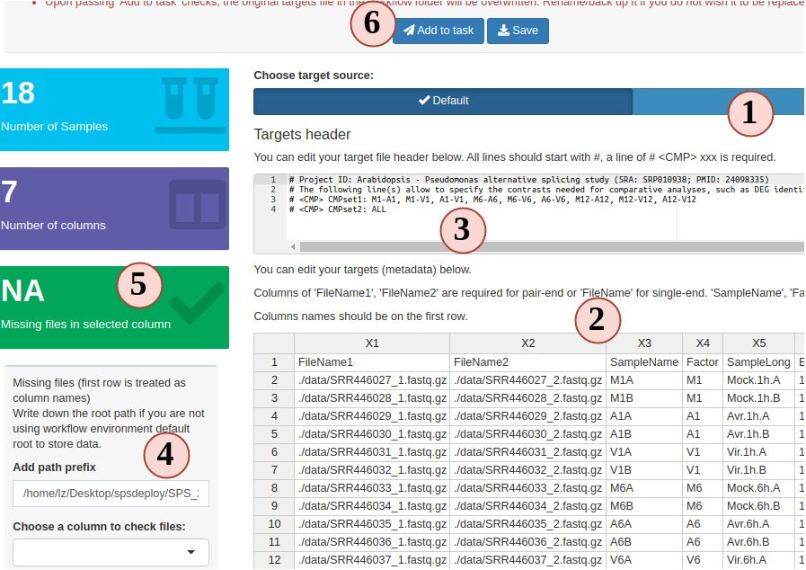
</center>
**Figure 3. A.** Workflow Management - Targets File

### 3. Prepare a workflow file

In SPR, workflows are defined in Rmarkdown files, you can read details and obtain them  [here](https://systempipe.org/pages/pipelines_area/).

Now let us follow the order below to see how SPS helps you to prepare a workflow file for a RNAseq project (Fig.3 B):

1. Your project workflow file is loaded for you, but you can choose to upload a different one.
2. The workflow structure is displayed in a tree-leaf-like plot. 
3. Check all steps in the workflow that you want to include. You can skip (uncheck) some steps but it may cause the workflow to fail. Read more SPR instructions before do so. 
4. Clicking on the "Plot steps" will show a flow chart of what the step execution orders will be when you run the workflow in SPR. 
5. Clicking "Report preview" generates a preview of what the final report will look like for current RNAseq workflow (hidden in Fig 3.B), but in the preview, no code is evaluated.
6. If you are satisfied with your workflow file, click "Add to task" to save your workflow file.

<center>
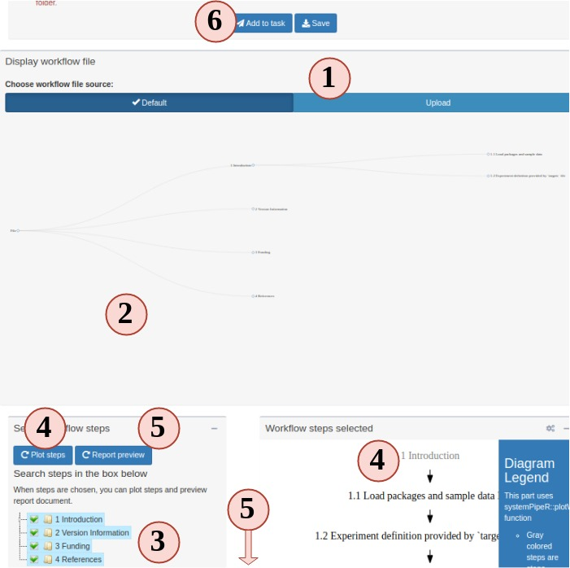
</center>
**Figure 3. B.** Workflow Management - Workflow File

### 4. Prepare CWL files (optional)

In the new version of SPR, all individual system workflow steps are called by the 
CWL files. Each SPR workflow has a set of CWL files and normally users do not need 
to make any change. In case you want to learn more about CWL and create some new 
CWL files, Step 4 is a good place to practice. 

To run a CWL step in SPR, 3 files are required: 

- targets: to determine how many samples will be run and sample names.
- CWL running file: can be translated to bash code;
- CWL input: variables to inject into the running file 

SPR is the parser between R and CWL by injecting sample information from targets 
to `CWL input` file and then CWL parser translates it to bash code. 

1. Most people are not familiar this part, so read instructions carefully.
2. Your project targets has been loaded for you, and an example CWL running and input 
for **hisat2** is also loaded for you. Directly parse the code. See what commandline 
code you get. 
3. Change the targets injecting column, and parse again, see what has changed. 
4. You can edit the CWL running and input files
5. Try to parse the new file and see what has changed.
6. If new CWL files has been created, you can edit workflow Rmd files by adding your 
new steps. 

<center>
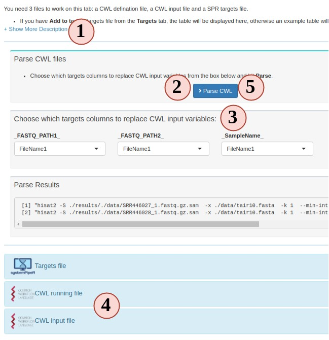
</center>
**Figure 3. C.** Workflow Management - CWL File

###  5. Run or finish workflow preparation

Up until this step, congratulations, the workflow is prepared. You can choose to 
download the workflow project files as a bundle or continue to run the workflow. 

<center>
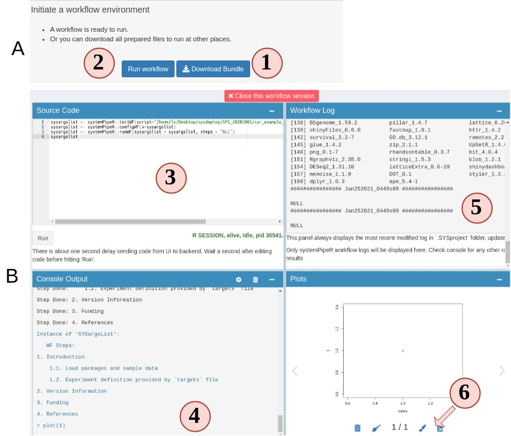
</center>
**Figure 4.A.B** Workflow Runner

1. On step 5 you can choose to download the prepared workflow or directly run the 
workflow. However, if you do not have the required commandline tools, workflow will 
most likely fail. Make sure you system has these tools ([Read about these tools](http://bioconductor.org/packages/release/bioc/vignettes/systemPipeR/inst/doc/systemPipeR.html#261_Third-party_software_tools)).
2. Open up the runner. It is a "Rstudio-like" interface. 
3. Code editor. Required workflow running code is pre-entered for you. You can simply 
hit "Run" to start. Of course, you can delete the default code and run random R 
code. 
4. Output R console. 
5. Workflow running log.
6. View any plot output. and send a copy of your current plot to SPS Canvas tab or 
download it. 

## RNA-Seq Module

This is a module which takes a **raw count table** to do normalization, 
Differential gene expression (DEG) analysis, and finally helps users to generate 
different plots to visualize the results. 


### Prepare metadata and count table
To start, we require two files, the metadata file (targets) and a raw count table (Fig. 5).  

<center>
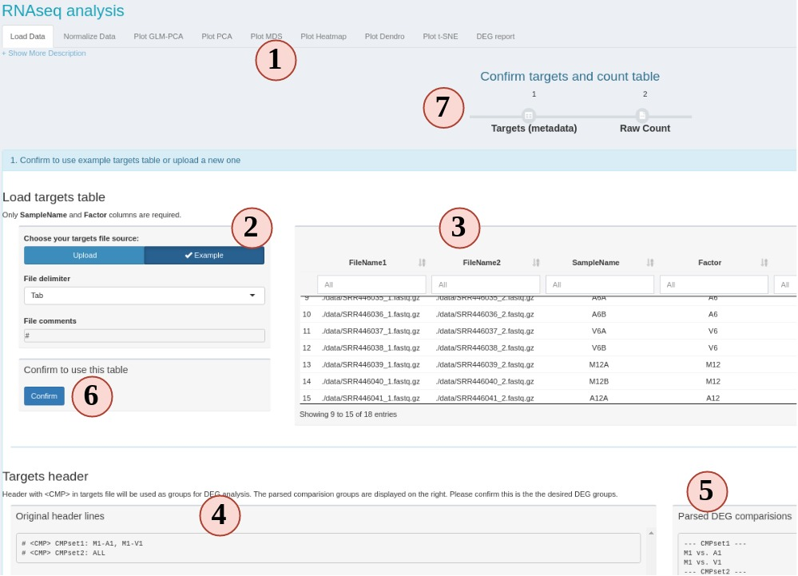
</center>
**Figure 5** RNAseq 

1. This is the RNAseq module UI when you first click it. All sub-tabs are disbled 
at the beginning. Other tabs will enabled as you proceed with different options.
2. First, we need a metadata file to tell SPS what samples and conditions to use. 
Here, we use the metadata file from SPR, which is also known as "targets" file. 
If you are not familiar with the targets file, we suggest to use the workflow module 
step 2 to practice creating and checking the format. You can also use the example to 
see how it looks like. 
3. The loaded targets table is display here. You can use the box below each column 
name to filter what samples to include/exclude. Only the "SampleName" and "Factor"
columns are used, other columns are ignored. `SampleName` should be a unique character 
string without space for each row.  `Factor` is the experiment design factors, or 
conditions, or treatments. 
4. If you want to DEG analysis, DEG comparison groups are defined in the targets 
file header. 
5. The header will be parsed into comparison groups which contain individual comparisons.
If the parsed comparison is not what you want, edit the header lines and reupload.
6. If everything is expected, confirm to use this table. 
7. You should see the progress timeline of step 1 becomes green if your targets 
and header pass the format checking. 
8. (Not on  figure) Similarly, use example or upload a count table and confirm to use it. 

Note: For the count table, the first column will be used as gene names. Other column 
names will be treated as sample names, and values in these columns are treated as 
raw counts. Make sure columns except the first one are **numeric**, and replace `NA` 
with `0`.

Upon successfully confirm targets and count table, you should see the "Normalize Data"
subtab is enabled. You can click on the top navigation or click the pop-up for the next 
step. 

### Process raw count 
If this UI is displayed, that means your targets and count table are accepted by 
SPS (Fig 6). On this sub-tab, you can choose: 

1. Transform your count data with "raw", "rlog" or "VST" and visualize the results
in other sub-tabs.
2. Do DEG analysis. 

These two options are independent. 

<center>
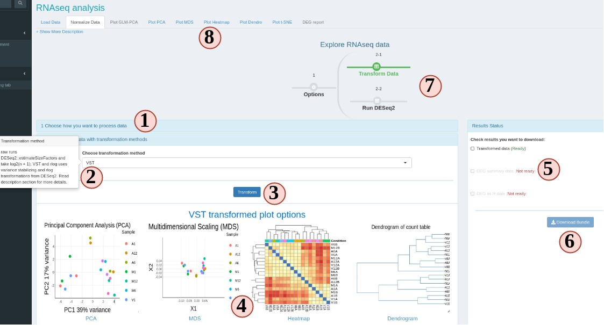
</center>
**Figure 6** RNAseq Normalization

1. At step 1 panel, choose how SPS can help you, count transformation or DEG analysis. 
The former will jump you to step 2, latter will jump to step 3. 
2. There are many options. If you are not clear, hover your mouse on the option, 
and some tips will show up. 
3. To start data transformation or DEG analysis. 
4. A gallery of different plot options will show up when the data process is done. 
5. When the data process is done, you can download results from the right side panel.
Check all items you want and SPS will help you to zip it into one file to download.
6. If at least one item is checked, downloading is enabled. 
7. Progress timeline will also change upon successful data process.
8. Different visualization options will be enabled depending on the data process options. 


### Plot options

SPS RNAseq module provides 6 different plot options to cluster transformed count table. 

<center>
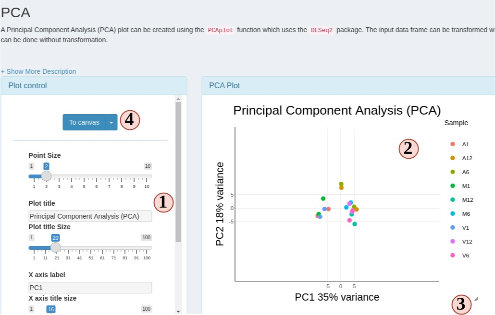
</center>
**Figure 6** RNAseq plots

1. Change plot options to customize your plots. 
2. Most plots are [Plotly](https://plotly.com) plots, which means you can interact 
with these plots, like hiding/show groups, zoom in/out, etc. 
3. All SPS plots are resizable. Dragging the bottom-right corner icon to resize your 
plot.
4. Click "To canvas" to take a screenshot of current plot and edit it in `SPS Canvas`
tab. Or clicking the down-arrow button to directly save current plot to a png or jpg. 

### DEG report 
This is a special sub-tab designed to filter and visualize DEG results. This sub-tab 
can be accessed once the DEG is calculated on the "Normalize Data" sub-tab. 


<center>
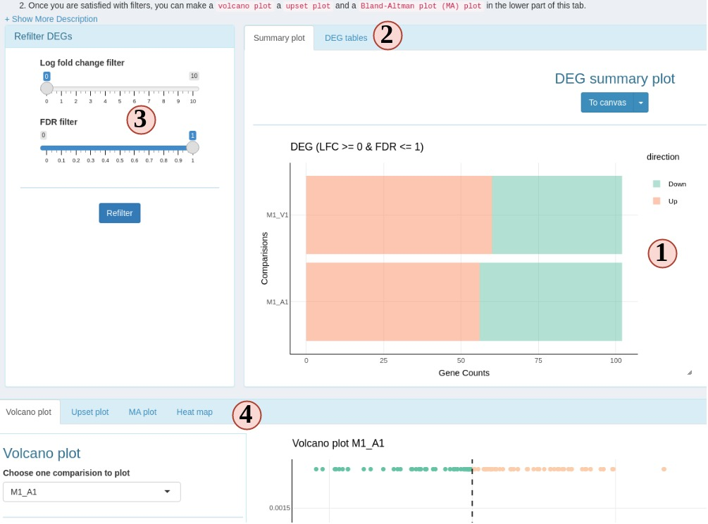
</center>
**Figure 7** RNAseq DEG

1. DEG summary plot. You can view what are the DEG results across different comparision 
groups. 
2. Switch to view a ggplot friendly table. Different from the table you could download from 
"Normalize Data" subtab, this DEG table is rearranged so you can easily make a ggplot from it. 
3. You can change the filter settings here, so DEGs will be re-filtered and you do not need 
to go back to "Normalize Data" subtab to recalculate DEG. 
4. DEG plotting options. Choose from a volcano plot, an upset plot (intersection), 
a MA plot or a heatmap. 


### Interact with other bioconductor packages.

#### Locally
If you are familiar with R and want to continue other analysis after these, simple stop SPS: 

1. After count transformation, there is a `spsRNA_trans` object stored in your R 
environment. `raw` method gives you a normalized count table. Other two methods 
give you a `DESeq2` class object. You can use it for other analysis.
2.  After DEG analysis,  SPS stores a global object called `spsDEG.`
It is a `summerizedExperiment` object which has all individual tables from all 
DEG comparisons. You can use it for other downstream analysis.


#### Remotely
If you are using SPS from a remote server, you can choose to download results from 
"Normalize Data" sub-tab. Choose results in tabular format or `summerizedExperiment`
format which is saved in a `.rds` file. 

## Quick {ggplot} module

This module enables you to quickly upload datasets and make a {[ggplot](https://ggplot2.tidyverse.org/)} 
in a second by using some functionalities from {[Esquisse](https://dreamrs.github.io/esquisse/index.html)}.

<center>
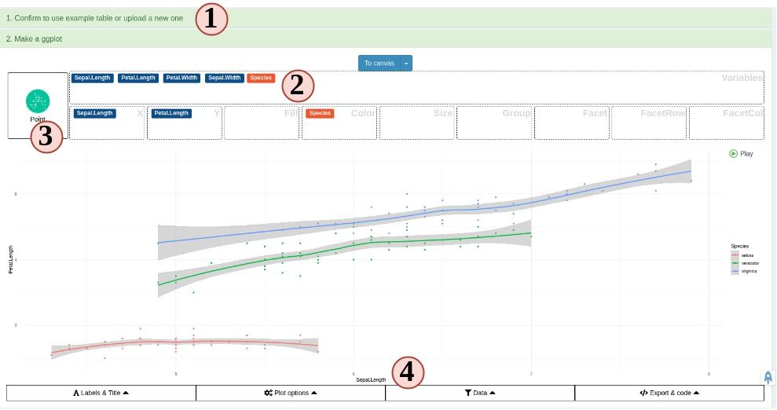
</center>
**Figure 8** Quick ggplot

1. Provide a tabular data table by uploading or use example. 
2. Drag variables from into different ggplot aesthetic boxes to make a ggplot.
3. Change to different plot types.
4. Customize other different plotting options. 

For a more specific guide, read [Esquisse official guide](https://dreamrs.github.io/esquisse/articles/get-started.html).


## Canvas

SPS Canvas is a place to display and edit scrennshots from different plots. To start 
to use Canvas, you need to take some screenshots but clicking "To Canvas" buttons 
on different tabs/modules. After clicking, the screenshots will be automatically sent 
from these places to this Canvas. 


<center>

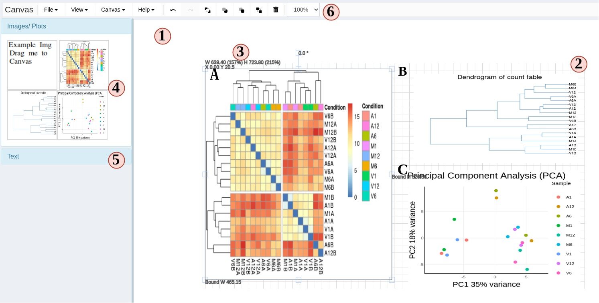

</center>

**Figure 9** Canvas


1. The Canvas area.
2. Canvas drawing grids. By default, your objects are limited to these drawing grids, but you can change it from top options inside "canvas".
The grid area size is automatically calculated to fit your screen size when you start SPS. 
3. Object information. When you select any object on the Canvas, a bounding box will show to display the object's dimensions, scale, angle and other information.
You can disable them in the "View" menu
4. To edit your screenshots, simply drag your screenshots from left to Canvas working area. 
5. You can add text or titles, and change the font color, decorations in this panel. 
6. Different Canvas options. Several menus and buttons help you to better control the Canvas.
Hover your mouse on buttons will display a tooltip of their functionality. 

Keyboard shortcuts are also enabled with SPS Canvas. Go to "help" menu to see these 
options. 


# Advanced features

To read the detailed advanced features, please to go our [website](https://systempipe.org/sps/).

# Version Information

```{r sessionInfo, eval=TRUE}
sessionInfo()
```

