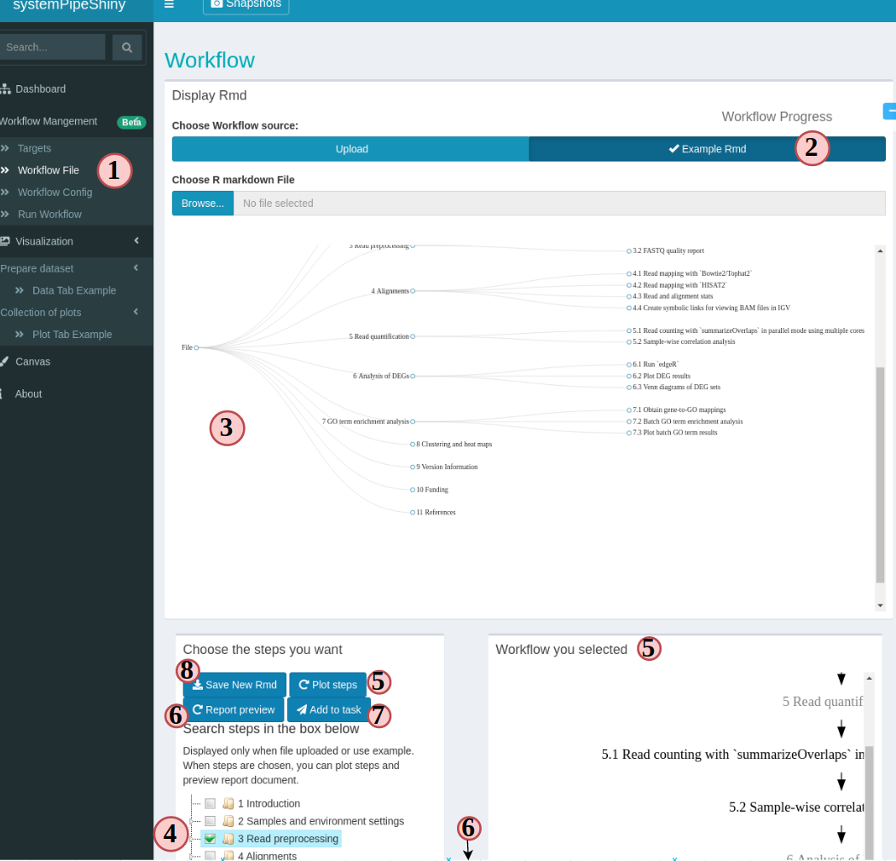
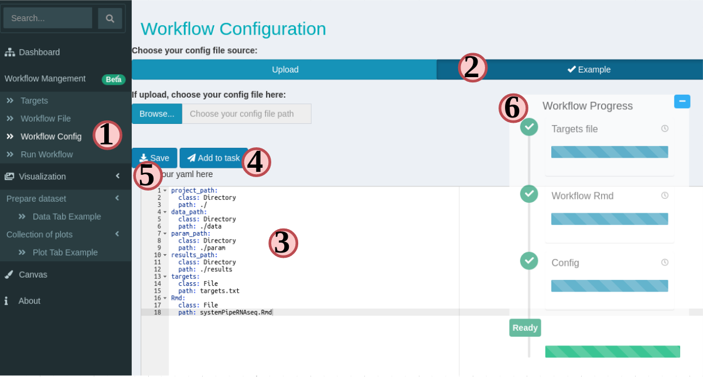
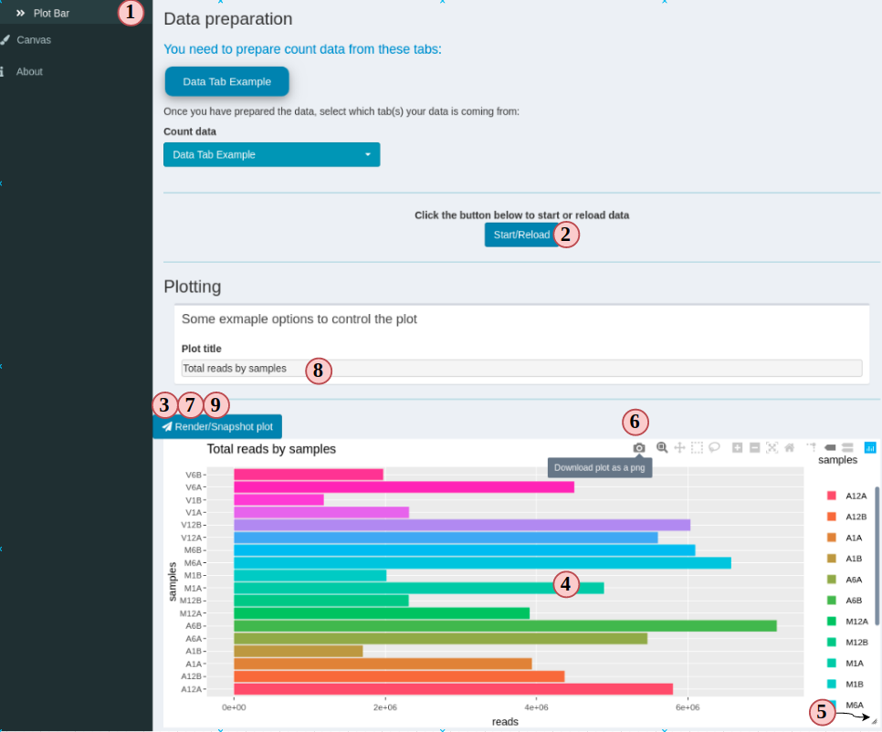

```{css, echo=FALSE, eval=TRUE}
pre code {
white-space: pre !important;
overflow-x: scroll !important;
word-break: keep-all !important;
word-wrap: initial !important;
}
```

```{r style, echo = FALSE, results = 'asis', eval=TRUE}
options(width=80, max.print=1000)
knitr::opts_chunk$set(
    eval=as.logical(Sys.getenv("KNITR_EVAL", "TRUE")),
    cache=as.logical(Sys.getenv("KNITR_CACHE", "TRUE")), 
    tidy.opts=list(width.cutoff=60), 
    tidy=TRUE,
    eval = FALSE)
# shiny::tagList(rmarkdown::html_dependency_font_awesome())
```

```{r setup, echo=FALSE, messages=FALSE, warnings=FALSE, eval=TRUE}
suppressPackageStartupMessages({
    library(systemPipeShiny)
})
```

```{r sps-css, results = 'asis', echo=FALSE, eval=TRUE}
cat("<style>")
cat(readLines(system.file("app/www/css/sps.css", package = "systemPipeShiny")),sep = "\n")
cat("</style>")
```

```{r logo, echo=FALSE, out.width='70%', fig.align='center', eval=TRUE}
knitr::include_graphics(path = "../inst/app/www/img/sps.png")
```

# Introduction

**<span style="color:#5DA7D6;">s</span>ystem<span
style="color:#5DA7D6;">P</span>ipe<span style="color:#5DA7D6;">S</span>hiny**
(SPS) extends the widely used [systemPipeR](https://bioconductor.org/packages/systemPipeR/) 
(SPR) workflow
environment with a versatile graphical user interface provided by a [Shiny
App](https://shiny.rstudio.com). This allows non-R users, such as
experimentalists, to run many systemPipeR's workflow designs, control, and
visualization functionalities interactively without requiring knowledge of R.
Most importantly, SPS has been designed as a general purpose framework for
interacting with other R packages in an intuitive manner. Like most Shiny Apps,
SPS can be used on both local computers as well as centralized server-based
deployments that can be accessed remotely as a public web service for using
SPR's functionalities with community and/or private data. The framework can
integrate many core packages from the R/Bioconductor ecosystem. Examples of
SPS' current functionalities include: (a) interactive creation of experimental
designs and metadata using an easy to use tabular editor or file uploader; (b)
visualization of workflow topologies combined with auto-generation of R
Markdown preview for interactively designed workflows; (c) access to a wide
range of data processing routines; (d) and an extendable set of visualization
functionalities. Complex visual results can be managed on a 'Canvas Workbench'
allowing users to organize and to compare plots in an efficient manner combined
with a session snapshot feature to continue work at a later time. The present
suite of pre-configured visualization examples include different methods to
plot a count table: PCA, t-SNE and plots of other clustering methods; volcano
plots, data mining plots including heatmaps, and more.  ^[<font style="color:green">
Dani: My opinion here is that if we mentioned some plot
here, we should provide the plots on the visualization tabs since we already
have these plots organized.</font> <font style="color:red">ThG: so why are 
they not shown by default for demo purposes? </font>] The modular design of 
SPR makes it easy to design custom functions without any knowledge of Shiny, 
as well as extending the environment in the future with contributions from 
the community.

An example web instance for testing `SPS` online is available
[here](https://tgirke.shinyapps.io/systemPipeShiny/){target="_blank"}. At the
time of writing, there are five interactive tutorials embedded in this instance
that users can access from the upper-right corner. Each tutorial introduces 
major functionalities of SPS.

# Installation

The `systemPipeShiny` package can be installed from a user's R console as follows.

```{r, eval=FALSE}
if (!requireNamespace("BiocManager", quietly=TRUE))
    install.packages("BiocManager")
BiocManager::install("systemPipeShiny")
```

If the user's OS is Linux then one may need to install the following dependencies.
The following example applies to Ubuntu.

```{bash, eval=FALSE}
sudo apt-get install libv8-dev
sudo apt-get install libssl-dev
sudo apt-get install libcurl4-openssl-dev
```

*libcurl4-openssl-dev* may not be required for Ubuntu > 18.04.

On other Linux distributions, the install commands may be slightly different. 

# Main functionalities 

Currently, `SPS` includes two main functional categories: (1) a workbench for
designing and configuring data analysis workflows (WF), and (2) a data
visualization (VS) toolbox (*Fig 1*). The WF module allows to write and to
modify configuration files required for running workflows in `systemPipeR`. The
VS module provides a rich set of plotting tools to visualize the results of
individual steps in `systemPipeR` workflow. The latter includes a Canvas
functionality that allows to arrange many plots in one page, save their them
and revisit the saved plots at a later time.

<center id="sps_structure">

</center>
**Figure 1.** Design of `systemPipeShiny.` The framework provides an
interactive web interface for workflow management and data visualization.

Within the functional categories, `SPS` functions are modularized in
sub-components, here referred to as **SPS tabs** that are similar to 
menu tabs in other GUI applications that organize related and inter-connected 
functionalies into groups. On the backend, **SPS tabs** are based on [Shiny modules](https://shiny.rstudio.com/articles/modules.html), 
that are stored in separate files. This modular structure is highly extensible 
and greatly simplifies the design of new `SPS` tabs by both users and/or developers. 
Details about extending existing tabs and designing new ones are provided in 
an [advanced user section](#extend-sps). 

# Example workflow with toy RNA-Seq data

The following sections illustrate the main functionalities of `SPS` using an analysis 
workflow for RNA-Seq data as an example.

## Load package

Load the `systemPipeShiny` package in your R session.

```{r sps_load_package, eval=TRUE}
library(systemPipeShiny)
```

## Initialize `SPS` project

Before launching the `SPS` application, a project environment needs to be created with the
following command.

```{r spsinit, eval=FALSE}
spsInit()
```

For this toy example, the project directory structure is written to a temporary
directory on a user's system. For a real project, it should be written to a
defined and user controlled location on a system rather than a temporary
directory.

```{r spsinit_temp, eval=TRUE}
sps_tmp_dir <- tempdir()
spsInit(app_path = sps_tmp_dir, change_wd = FALSE, project_name = "SPSProject")
sps_dir <- file.path(sps_tmp_dir, "SPSProject")
```

### SPS project structure

The file and directory structure of an SPS project is organized as follows. 

<pre>
SPS_xx/  
├── server.R               <span class="text-success">|</span> 
├── global.R               <span class="text-success">| Most important server, UI and global files, unless special needs, `global.R` is the only file you need to edit manually</span>   
├── ui.R                   <span class="text-success">|</span>  
├── deploy.R               <span class="text-info">| Deploy helper file</span>  
├── config                 <span class="text-success">| Important app config files. Do not edit them if you don't know</span>  
│   ├── sps.db             <span class="text-gray">| SPS database</span> 
│   ├── sps_options.yaml   <span class="text-gray">| SPS default option list</span> 
│   └── tabs.csv           <span class="text-gray">| SPS tab information</span> 
├── data                   <span class="text-primary">| App example data files</span> 
│   ├── xx.csv             
├── R                      <span class="text-primary">| All SPS additional tab files and helper R function files</span> 
│   ├── tab_xx.R            
├── README.md              
├── results                <span class="text-gray">| Not in use for this current version, you can store some data been generated from the app</span> 
│   └── README.md          
└── www                    <span class="text-primary">| Internet resources</span>  
    ├── about              <span class="text-gray">| About tab information</span> 
    │   └── xx.md          
    ├── css                <span class="text-info">| CSS files</span>  
    │   └── sps.css         
    ├── img                <span class="text-info">| App image resources</span>    
    │   └── xx.png         
    ├── js                 <span class="text-info">| Javascripts</span>
    │   └── xx.js           
    ├── loading_themes     <span class="text-info">| Loading screen files</span> 
    │   └── xx.html         
    └── plot_list          <span class="text-info">| Image files for plot gallery</span>  
        └── plot_xx.jpg      
</pre>

## Launch `SPS` 

By default, the working directory will be set inside the project folder automatically. 
To launch the `SPS` Shiny application, one only needs to execute the following command.

```{r, eval=FALSE}
shiny::runApp()
```

After the SPS app has been launched, clicking the "Continue to app" button
on the welcome screen will open the main dashboard (Fig.2).

<center id="sps_ui">

</center>
**Figure 2:** Snapshot of SPS' UI.^[<font style="color:red">ThG: note don't center
the legend of figures, and only the Figure xyz part should be in bold. The actual
legend text is in non-bold.</font>]

Alternatively, when using RStudio one can click the `Run App` button in the top right corner.

In addition, in Rstudio the *global.R* file will be automatically
opened when the `SPS` project is created. Custom changes can be made inside this file
before the app launches. The [advanced section](#extend-sps) explains how
to create custom tabs.  ^[<font style="color:green">Dani:I think this
advanced information could be confusing in this stage of the documentation
(discussing and showing details about the global.R file), so I believe we can
add this to the advanced features section and just to link here. </font>
<font style="color:red">ThG: yes, just show some demo tabs and move the 
customization stuff to the advanced section. </font>]


## Workflow management

The workflow management module in `SPS` allows to modify or create the
configuration files required for running data analysis workflows in
[systemPipeR](https://systempipe.org/docs/systemPipeR/) (SPR). This includes
three important files: a sample metadata (targets) file, a
workflow file (in R Markdown format) defining the workflow steps, and a workflow
config file organizing the workflow directory. In SPS, one can easily create
these files under the "Workflow Management" module, located in navigation bar
on the left of the dashboard (Fig2 a-b). 

The current version of SPS allows to create and/or check the format of these 
files. The execution of SPR workflows via SPS will be supported in the next
release.

### Prepare a target file

The targets file defines all input file paths and other sample information of
analysis workflows. To better undertand the structure of this file, one can
consult the ["Structure of targets
file"](https://systempipe.org/docs/systemPipeR/#structure-of-targets-file)
section in the SPR vignette. Essentially, this is the tabular file representation
of the `colData` slot in an `SummarizedExperiment` object which stores sample
IDs and other meta information. 

The following step-by-step instructions explain how to create and/or modify targets 
files using RNA-Seq as an example (Fig.3 A):

1. Choose "Targets" from navigation bar.
2. Select either "Example PE" or "Example SE"" for using a pair-end/single-end target file, then choose "confirm" on the pop-up. You will see the example is loaded like Figure 3A. 
3. You can edit, right click to add/remove rows/columns (The first row is treated as column names).
4. SPR target file includes a header block, that can also be edited in the SPS app. Each headers needs to start with a "#".
5. The section on the left provides sample statistics and information whether files exist on a user's system. Choose any column you want from the dropdown to check and watch the statistics bar change in this section;
6. Clicking on "Add to task" can help you to check if your target file has any formatting problem. You should see a green success pop-up if everything is right.
7. Now your target file is ready and you can click "save" to download it and later use in a SPR project. 
8. Click on the "-" button on the "Workflow Progress", you should see the "Targets file" becomes green. 

<center>

**Figure 3. A. Workflow Management - Targets File**
</center>

### Prepare a workflow file

In SPR, workflows are defined in Rmarkdown files, you can read details and obtain them  [here](https://systempipe.org/pages/pipelines_area/).

Now let us follow the order below to see how SPS helps you to prepare a workflow file for a RNAseq project (Fig.3 B):

1. Choose "Workflow File" from navigation bar;
2. Choose "Example Rmd" to load an RNAseq workflow;
3. You can see the workflow steps are displayed like a tree structure;
4. Check all steps in the workflow that you want to include. You can skip (leave blank) some steps but it may cause the workflow to fail. Read more SPR instructions before do so. 
5. Clicking on the "Plot steps" will show a flow chart of what the step execution orders will be when you run the workflow in SPR. 
6. Clicking "Report preview" generates a preview of what the final report will look like for current RNAseq workflow, but in the preview, no code is evaluated.
7. If you are satisfied with your workflow file, click "Add to task" to update the workflow preparation progress just like it is for "targets file".
8. Now choose "Save New Rmd" to save this new workflow file to later be used a SPR RNAseq project running. 

<center>

**Figure 3. B. Workflow Management - Workflow File**
</center>

### Prepare a configuration file

In SPR, the config file *SPRconfig.yaml* is required to define information like *project path*, *targets file path* and more. 
Normally, this file is generated automatically when one starts a SPR project, but if any modification is made, 
one needs to update this config file. For example, like we are now using SPS to prepare targets file and workflow file and when we download these new files, file names and locations may be changed. In this case, we can update the config file in SPS (Fig.3 C):

1. Choose "Targets" from navigation bar;
2. Choose "Example" to load an RNAseq config file;
3. Edit the file content and follow *yaml* format. You may need to update the target file and workflow file name and location in the "*targets*" and "*Rmd*" lines here. 
4. Once your editing is done, click "Add to task" to update the progress;
5. Now your new config file is ready and you can click "Save" to download it;
6. The progress tracker should all become green, which means you are ready to run the RNAseq workflow in SPR. 

<center>

**Figure 3. C. Workflow Management - Config File**
</center>

###  Finish workflow management

If you have followed this instruction so far, the three most important workflow files 
have been created. You can copy them over to your SPR RNAseq project root and start to 
generate results. 

## Visualize workflow results

In the previous step that we have prepared files for running a SPR RNAseq workflow. 
Now assume that the workflow has been successfully run and we have obtained some results. In this 
part, we will use an example **count table** (RPKM normalized) to demonstrate 
how to use the VS components. 

VS tabs in SPS are sub-defined into two small groups, *data tabs* and *plot tabs*. A data tab 
is where you prepare, filter and preprocess data. A plot tab is where the actual plots are generated.
A plot tab requires at least one dataset from a data tab. Therefore, we need to first 
prepare data in a data tab, depending on the preprocess method we choose, we will be given 
different plot options (going to different plot tabs).

In this part, we will first load the raw count table and preprocess it in "Data Tab Example", generate some plots in "Plot Tab Example", and finally compare plots in the "Canvas" tab.

### Load raw count data

Follow instructions in Figure 4A:

1. Select "Data Tab Example" tab from the left;
2. Click "Start with this tab", it will be hidden after package requirement check has passed in the background. So it is not displayed in the figure. 
3. Let us load an example RPKM  read count table. If you upload your own table, 
the first column must be "Genes" and the rest of columns are treated as samples and they must be numeric values only. 
4. You can click on box below each column name to filter data. 
5. You can export your filtered data into clipboard, csv files, Excel ...
6. After the data filtration, we can start to preprocess data. Here are two methods you can choose from the left dropdown menu: "Do Nothing" does not change the filtered data, and "PCA" calculates PCs based on samples. Let us just try "Do Nothing";
7. When the data is preprocessed, plot options will be displayed in the below. You need to scroll down a little to see. "Do Nothing"  will give you the option 
for a bar plot. Click on the plot image will redirect you to the corresponding tab. 

<center>

**Figure 4 A. VS - data tab**
</center>

### Create a plot

Follow instructions in Figure 4B:

1. Skip this step if you jumped directly from the "Data Tab Example", otherwise select "Plot Bar" to start;
2. Click "Start/Reload", this button will validate if you have the required data set. If yes, you will see plot options and other UI.
3. Click on "Render/Snapshot plot" to create the first plot. In SPS, the first time clicking on "Render" button creates a preview of the plot. From the second time and on, clicking on this button will take a *"snapshot"* of the plot. In SPS a snapshot is plot frozen with particular set of input data and plot options. It is isolated from the original plot tab and you cannot modify it anymore. It is similar to a screenshot but you can still interact within the plot. You will have a better understanding when we reach the *Canvas* section.
4. Now you can interact with plot. Try to hover your mouse and move around the plot. There are many interactive components on the plot. Read more of what you can interact with a [Plotly plot](plotly.com).
5. There is a tiny triangular icon on the right bottom corner of the plot where you can drag it to resize the plot to at most your window width and unlimited height;
6. A panel of plot selection tools including a screenshot button is on the top 
right;
7. Let us take a snapshot by clicking "Render". You should see a blue message pop up from the right bottom of your screen.
8. You can change the plot title by changing the text. This example plot tab only provides very simple plot controls. Change the text and watch how the plot title change. 
9. Change a title and click "Render" again to take a second snapshot.

<center>

**Figure 4 B. VS - plot tab**
</center>

## Snap shots and Canvas

### Canvas

SPS Canvas is a place to display snapshots.  Snap shots can come from different
plot tabs, or the same plot tab with different plot options. Here you can combine 
plots together to a big scientific figure and compare plots with different plotting options side by side. 

If you have followed the instructions so far, you should have at least two snapshots and we can start to use Canvas.

1. Select "Canvas" tab;
2. You will see your snapshots in "Current snapshots" box. If you do not want to 
see any of them, drag it to the right side so it will not be rendered on Canvas.
3. Click "Refresh Canvas" to render the Canvas for a quick glimpse; 
4. You can change some Canvas settings on top;
5. In the "bar plot" section, we took two snapshots, one with original plot title and one with custom title. If you made the change, you can see it is reflected on 
Canvas. Move your mouse on the plots, you can see they are still interactive. Then, when you move the mouse near the top of a plot, a title section will show up and you can drag it to reposition your plot. 
6. Similar to a plot tab, you can resize any plot on Canvas by dragging the bottom right corner of a plot. 

<center>

**Figure 5 A. Canvas**
</center>

Now go back to [Load raw count data](#load-raw-count-data) section and select 
"PCA" option in step 6 to reprocess and then go to PCA plot tab and repeat
instructions in [Create a plot](#create-a-plot) to create and snapshot a few PCA 
plots. The PCA plot tab has an additional plot point size control UI. You can try 
to take snapshots with different point size. Finally come back to canvas and render all snapshots. You should then be able to see how point size on plots are different in different snapshots. 
Now you can have a better understanding of the SPS snapshot-Cnavas feature.

### Snapshot management

Taking too many snapshots will slow down the app. A good solution is to manage 
them through the snapshot manage menu. You can access it by clicking the 
button "Snapshots" with a camera icon on the very top of SPS dashboard banner. 
It will open up a big menu screen (Fig. 5B). 

1. The left side displays all current snapshots. The label means the plot tab ID of which plot tab it comes from and the number after the dash means it is the Nth snapshot coming from that particular plot tab;
2. If you want to delete any snapshot, drag it to the right;
3. Click on "DESTROY" will permanently delete selected snapshots and cannot be recovered.
4. Download your current snapshots to a compressed file.
5. You can upload saved snapshot file and continue to work on it later. 

Due to internet security reasons, snapshot files are encrypted. Each SPS project 
has an unique key pair. Therefore, it is not possible to run a snapshot file in 
a different SPS project. 

<center>

**Figure 5 B. snapshot management**
</center>


# Advanced features


## SPS plugins

We have created many more plots options and 
they are distributed as "SPS plugins". A SPS plugin is a collection of SPS tabs that 
become small R packages. 
You need to install the plugin like you do with normal R packages by `install.packages`, 
`BiocManager::install` or `remotes::install_github()`. The plugins(packages) come with 
SPS tabs, data, and other helper functions. Using `spsAddPlugin()` function, you 
are able to load them into SPS framework. 

Using `spsAddPlugin()` without any argument will list all available plugins and 
instructions to install them. 

```{r , eval=TRUE}
spsAddPlugin()
```

To load a specific plugin:

```{r , eval=FALSE}
spsAddPlugin(plugin = "PLUGIN_NAME", app_path = "PATH_OF_SPS")
```

At this stage, there is only one plugin, the *spsBio*: plots for biological data 
visualization. It is **under testing and please expect unstableness**. Under your project 
directory:

```{r, eval=FALSE}
remotes::install_github("systemPipeR/spsBio")
spsAddPlugin(plugin = "spsBio")
```

Inside your SPS project root, in the *global.R* file, specify that you want to 
load the plugin to app and start the app like normal:
```{r}
sps_app <- sps(
    vstabs = c("data_example", "plot_example1", "plot_example2"),
    plugin = "spsBio",
    server_expr = {
        msg("Custom expression runs -- Hello World", "GREETING", "green")
    }
)
```

## Configuration

### App options

App options in SPS are controlled by "SPS options". These options can change 
app appearance, debugging level, server server behaviors, *etc*. The valid options can 
be found and change on the `global.R` file. They are similar to *Shiny* options, 
but unlike *shiny* options are single values, SPS options are passed using the `Option(sps = list(...))` 
function in `global.R` as a group. To view all options and their default, valid
values('*' means any value is okay):

```{r, eval=TRUE}
viewSpsDefaults(app_path = sps_dir)
```

To view a single option value, use `spsOption(opt = "OPTION_NAME")`; to overwrite a single 
option, use `spsOption(opt = "OPTION_NAME", value = "NEW_VALUE")`.

<p style="color:var(--info)">Note: Do not worry if you set some invalid values, on app start, `sps()` will check all SPS
options, ignore unknown values and set invalid values back to default. You will see warning 
messages on console to tell you specifically what is wrong with your options.</p>

| Option          | Description                       | Default | Other     |
|-----------------|-----------------------------------|---------|-----------|
| mode            | running mode                      | "local" | "server"  |
| warning_toast   | show security warnings?           | TRUE    | FALSE     |
| loading_screen  | show loading screen?              | TRUE    | FALSE     |
| loading_theme   | loading screen theme              | "vhelix"| any string|
| use_crayon      | colorful console message?         | TRUE    | FALSE     |
| verbose         | more details for SPS functions?   | FALSE   | TRUE      |
| admin_page      | show admin page?                  | FALSE   | TRUE      |
| admin_url       | admin_page query url              | "admin" | any string|

some details:

- mode: this option will change how the upload files are selected.
    - local: You can choose file from server side, and it is a direct link, no file will be copied to server. Most often used when you are on you own computer. <span style="color:var(--info)">It is still choosing files from the server side, because you are using your own computer as a Shiny server.</span>
    - server: Choose files from the client side, and upload as a temp file to the server.
    - If you are on you own computer, there is no difference, but `local` mode can avoid copy your files to temp. <span style="color:var(--info)">If you are deploying the app to cloud, please **use server mode**</span>
- warning_toast: A toast pop-up message when you are under some dangerous options when app starts.
- loading_theme: `loading_screen` must be `TRUE`. Only one theme for now, we will add more in future.
- verbose: Give you more information on debugging.
- admin_url: the admin page url, `admin_page` must be `TRUE` for it to work. It will be added in an upcoming version, a preview can be seen by adding "/?admin" to the end of app url, e.g. "[https://tgirke.shinyapps.io/systemPipeShiny/?admin](https://tgirke.shinyapps.io/systemPipeShiny/?admin)".

### Tab configurations

Tabs are registered(defined) by the *tabs.csv* file under SPS project *config* folder. It contains information for all 
the tabs. Do not modify it if you don't plan to build new tabs. See [developer section](#extend-spsfor-developers) for how 
to operate this file. 

To control what tabs to appear(load/unload) on SPS, pass the tab IDs of tabs you want to see to 
`vstabs =` argument on `sps()`

```{r , eval=FALSE}
sps_app <- sps(vstabs = c("ID1", "ID2", ...))
```

*tabs.csv* has all the tab IDs. Under current version of SPS, you can only load/unload 
tabs in the "vs" type. Tabs under "core" and "wf" types are unable to change.

## A variety of additional shiny widgets 

There are many useful HTML components that 
can be use outside out SPS. You can include these widgets in your own Shiny apps without 
loading SPS main framework. 

# Extend `SPS`

As a framework, `SPS` allows users to add/remove/customize individual tabs. At current 
version, you can only modify tabs in Visualization module (data tabs, plot tabs). 
Use `newTabData` to add a new data tab and `newTabPlot` for a plot tab. These functions 
will help you to **create the tab file**, store it to the *R* folder in your SPS project, and
**register tab information** by adding records to *config/tabs.csv*.
Most arguments are self-explanatory or can be 
easily understood by reading the the help file. 

## Adding the new tabs at your SPS application 

In your *global.R*, scroll down to the bottom, you should see:

```{r, eval=FALSE}
sps_app <- sps(
    vstabs = c("data_example", "plot_example1", "plot_example2"),
    plugin = "",
    server_expr = {
        msg("Custom expression runs -- Hello World", "GREETING", "green")
    }
)
```

This is the SPS main function. You can load/unload tabs by providing tab IDs in `vstabs` argument, like
`c("tab1", "tab2)`. Open *config/tabs.csv* or use `spsTabInfo()` to see what tabs IDs can be load and other
tab information. Currently you can only load/unload visualization tabs, the key word `vs` under column "*type*";
essential framework tabs(*core*) and workflow tabs (*wf*) are loaded automatically and these tabs cannot be modified.

# How to deploy the application

There is a *deploy.R* file in the SPS project root and you can use it to deploy the 
app to [shinyapps.io](https://www.shinyapps.io/). You can use this file to set up 
your account and deploy the app. SPS is a deploy-ready framework. If you set up your 
account correctly, you can deploy it as soon as the project is created. It 
is recommended to create -> test/run -> deploy a Shiny app from Rstudio and follows 
[this instruction](https://shiny.rstudio.com/articles/shinyapps.html).

# Version Information

```{r sessionInfo, eval=TRUE}
sessionInfo()
```

