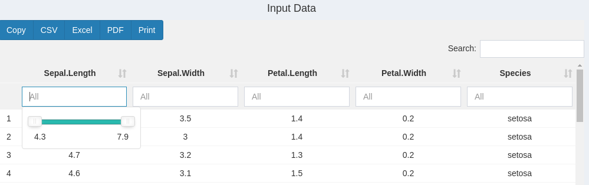

```{css, echo=FALSE, eval=TRUE}
pre code {
white-space: pre !important;
overflow-x: scroll !important;
word-break: keep-all !important;
word-wrap: initial !important;
}
```

```{r style, echo = FALSE, results = 'asis', eval=TRUE}

options(width=60, max.print=1000)
knitr::opts_chunk$set(
    eval=as.logical(Sys.getenv("KNITR_EVAL", "TRUE")),
    cache=as.logical(Sys.getenv("KNITR_CACHE", "TRUE")), 
    tidy.opts=list(width.cutoff=60), 
    tidy=TRUE,
    eval = FALSE)
# shiny::tagList(rmarkdown::html_dependency_font_awesome())
```

```{r setup, echo=FALSE, messages=FALSE, warnings=FALSE, eval=FALSE}
suppressPackageStartupMessages({
    library(systemPipeShiny)
    # library(systemPipeR)
})

```

```{r sps-css, results = 'asis', echo=FALSE, eval=TRUE}
cat("<style>")
readLines(system.file("app/www/css/sps.css", package = "systemPipeShiny")) %>% 
cat(sep = "\n")
cat("</style>")
```


```{r logo, echo=FALSE, out.width='70%', fig.align='center', fig.width=12, eval=TRUE}
knitr::include_graphics(path = "../inst/app/www/img/sps.png")
```


# Introduction

**<span style="color:#5DA7D6;">s</span>ystem<span style="color:#5DA7D6;">P</span>ipe<span style="color:#5DA7D6;">S</span>hiny**(SPS)
is a [Shiny](https://shiny.rstudio.com/)-based R/Bioconductor package that  has two main purposes: 

 1. To help non-programmers like wet lab researchers on data analysis workflow management and downstream data 
visualizations with a graphical user interface(GUI). 
 2. An user friendly framework for both beginners and advanced developers to fast extend 
 with more visualization options(more plot types) and to quickly deploy the app to a Shiny sever. 
 
You can try our demo at [here](https://tgirke.shinyapps.io/systemPipeShiny/). There are 5 
different interactive tutorials embedded on the demo that you can follow(right upper corner). 
Each tutorial covers a major topic of SPS and show how you can interactive with app.

This vignette introduces main features and functionalities of SPS. Due to size limit, 
a full version of users' manual will be later updated at [SytemPipeShiny-book](https://systempipe.org/systemPipeShiny-book/) 
which will include more small demos, screenshots, and *gif* illustrations.

## Motivation

SPS is originally designed as a GUI extension for the R workflow environment tool systemPipeR(SPR)
to help users prepare a workflow and understand the workflow structure in an interactive way. 
Later, SPS is enriched with other utilities, like the visualization part. Therefore, we decide to 
move SPS as a stand-alone package. 

# Quick start

## Install

To install SPS:

```{r, eval=FALSE}
if (!requireNamespace("BiocManager", quietly=TRUE))
    install.packages("BiocManager")
BiocManager::install("systemPipeR/systemPipeShiny", build_vignettes=TRUE, dependencies=TRUE)
```

If you are on Linux, you also need(use Ubuntu as example):

```{bash, eval=FALSE}
sudo apt-get install libv8-dev
sudo apt-get install libssl-dev
sudo apt-get install libcurl4-openssl-dev
```
*libcurl4-openssl-dev* may not be required for Ubuntu > 18.04.

Depending on the Linux distributions, command can be slightly different. 

## Start the app

Before starting with SPS, you need to create a SPS project: 

```{r spsinit, eval=TRUE}
sps_tmp_dir <- tempdir()
spsInit(dir_path = sps_tmp_dir, change_wd = FALSE)
sps_dir <- file.path(sps_tmp_dir, glue("SPS_{format(Sys.time(), '%Y%m%d')}"))
```
Here for building the vignette we are not switching to the app directory and are using a 
temp directory, in a real case, you **shouldn't** store you SPS project in a **temp directory**.
Just use the following instead:

```{r , eval=FALSE}
spsInit()
```


By default, you will get a folder created under your current working directory, 
the name is `SPS_` + `today's date` in *ISO 8601* format, e.g. 
`r glue::glue("SPS_{format(Sys.time(), '%Y%m%d')}")`

<p style="color:var(--info)">Note: all SPS date or time stamp objects use *ISO 8601* format</p>

By default, your working directory should be set inside that project folder automatically. 
If you are using Rstudio,  `global.R` file will be opened for you. This is the only
file that you need to make custom change if there is any. 
Now you can just run the app by type `shiny::runApp()` in console or click on the `Run App`
button on top right corner of the any these 3 files in Rstudio. 
In your global.R, scroll down to the bottom, you should see:


```{r, eval=FALSE}
sps_app <- sps(
    vstabs = "",
    server_expr = {
        msg("Custom expression runs -- Hello World", "GREETING", "green")
    }
)
```

This is the SPS main function. You can load/unload tabs by providing tab IDs in `vstabs` argument, like 
`c("tab1", "tab2)`. See `config/tabs.csv` in your project folder for what tabs IDs can be load and other 
tab information. Currently you can only load/unload visualization tabs, type of *vs*; core tabs(*core*) and 
workflow tabs (*wf*) are loaded automatically. You can run additional server code by passing it to
`server_expr` argument. If the expression is multiple-lined, use `{}` to wrap them. 


# SPS structure
## App directory structure

When a SPS project is created, you would expect the directory contains: 
<pre>
SPS_xx/  
├── server.R               <span class="text-success">|</span> 
├── global.R               <span class="text-success">| Most important server, UI and global files, unless special needs, `global.R` is the only file you need to edit manually</span>   
├── ui.R                   <span class="text-success">|</span>  
├── deploy.R               <span class="text-info">| Deploy helper file</span>  
├── config                 <span class="text-success">| Important app config files. Do not edit them if you don't know</span>  
│   ├── sps.db             <span class="text-gray">| SPS database</span> 
│   ├── sps_options.yaml   <span class="text-gray">| SPS default option list</span> 
│   └── tabs.csv           <span class="text-gray">| SPS tab information</span> 
├── data                   <span class="text-primary">| App example data files</span> 
│   ├── xx.csv             
├── R                      <span class="text-primary">| All SPS additional tab files and helper R function files</span> 
│   ├── tab_xx.R            
├── README.md              
├── results                <span class="text-gray">| No in use for this current version, you can store some data been generated from the app</span> 
│   └── README.md          
└── www                    <span class="text-primary">| Internet resources</span>  
    ├── about              <span class="text-gray">| About tab information</span> 
    │   └── xx.md          
    ├── css                <span class="text-info">| CSS files</span>  
    │   └── sps.css         
    ├── img                <span class="text-info">| App image resources</span>    
    │   └── xx.png         
    ├── js                 <span class="text-info">| Javascripts</span>
    │   └── xx.js           
    ├── loading_themes     <span class="text-info">| Loading screen files</span> 
    │   └── xx.html         
    └── plot_list          <span class="text-info">| Image files for plot gallery</span>  
        └── plot_xx.jpg      
</pre>

## App UI structure
SPS provides two core components -- workflow management and data visualization. 
The UI is designed as a dashboard(*Fig 1*). Individual components are classified 
into two categories of tabs (*Fig 1. a-b*).

<center id="sps_ui">

**Figure 1. SPS UI**
</center>

The app UI structure can be understood as following(*Fig 2*). Users first need to choose 
either the workflow or visualization part to start with. Workflow part helps users to 
prepare data analysis workflow files in [systemPipeR](http://systempipe.org/)(SPR) format. 
Visualization part helps users to make different types of plots, take interactive snapshot 
of plots and combine/compare different plots on the "Canvas" workbench. 

To start, click on the "Workflow Management" or "Visualization" on the left navigation 
bar will direct you to the workflow or visualization main page. There will be some 
general summary and instructions.

<center id="sps_structure">

**Figure 2. SPS Structure**
</center>

# UI details(for users)
## Workflow management 

 Workflow management helps you to prepare a data analysis workflow files in SPR format or can be used in other similar 
 compatible workflow environments. Files include the metadata(targets) file, workflow 
 step file(Rmarkdown format) and a workflow config file. Each of these files are 
 prepared in a SPS tab. You can find them at the left side navigation bar. 
 SPS helps users to check the formats and requirements of each file. Users can click on the
<button type="button" class="btn btn-default">
    <i class="fa fa-paper-plane"></i>
        Add to task
</button> 
button on the page to check for problems. If everything is correct, a 
pop-up message will show to users or if anything is wrong, a detailed window will 
pop up to indicate errors. 

In the upcoming version of SPS, users can directly run a workflow on the app, but for 
now users need to download these files and copy them to a SPR project and run from 
command line or R. You can download these files by clicking 
<button  class="btn btn-default">
     <i class="fa fa-download"></i>
     Save
</button>.

To see how your file preparation status, you can also open up the [progress tracker](#progress-tracking).

### Targets file

In SPR environment, the metadata file is also called the *targets file*. The *Targets* 
tab in SPS will help you to prepare this file(*Fig3. A*). The targets file has 2 
parts: header and data. Header should start with `#` and you can edit it or add new 
lines in the editing box. Data is loaded as table, and you can also edit, right-click 
to add/remove records. If you are on *[local mode](#app-options)*, the left-side panel will also 
show targets statistics and can check the file existence of your selected column. 

<center>

**Figure 3. A. Workflow Management - Targets File**
</center>

### Workflow file

A workflow file is a file that defines workflow steps. In SPR, this is provided as 
a R markdown file, so you need to prepare a file with `.Rmd` extension or download 
one template from SPR. Once your have uploaded or used the example, you can see the 
workflow steps in a tree-like structure(*Fig3. B*). The step levels in SPR are defined by
the hash tag `#` level in Rmd, the same way as the tile level in a markdown file. 
For example, text and code under a single `#` title means this is a top level step, 
text and code under `##` title is a secondary sub step ...

To choose the steps you want to run, check them inside the "Choose the steps you want"
section. If there are some substeps under a major step, you can click the triangle button 
 to
expand and choose substeps. 

If at least one step is checked, the 4 buttons in "Choose the steps you want" will be enabled.

- <button  class="btn btn-default"><i class="fa fa-download"></i>Save New Rmd</button> Save your chosen steps and download as a new workflow file.
- <button  class="btn btn-default"><i class="fa fa-redo-alt"></i>Plot steps</button> A workflow diagram show the order of execution of steps you choose.
- <button  class="btn btn-default"><i class="fa fa-redo-alt"></i>Report preview</button> The preview of what the workflow R markdown file look like when it is rendered, but no code is executed. 
- <button  class="btn btn-default"><i class="fa fa-paper-plane"></i>Add to task</button> Add to a workflow task, will be useful in future. 


<p style="color:var(--info)">Note: Skip(uncheck) some steps may cause the workflow fail to run, read more [SPR instructions](https://systempipe.org/docs/systemPipeR/)</p>

<center>

**Figure 3. B. Workflow Management - Workflow File**
</center>

### Configuration File

SPR uses a *yaml* file to control some workflow configurations. It is automatically been 
generated when you create a SPR project and normally you don't need to change anything. 
Here the config tab just provides a place you can edit the config file and download it 
back to a SPR project.

## Data Visualization

### Tabs
There are two types of data visualization(VS) tabs: *data tab* and *plot tab*. A data 
tab is where you prepare plotting data, including different preprocess options. 
Depending on the data tab and preprocess options you choose, you will be given different 
plot tab options. 

You should first going to the VS main tab by clicking *<i class="fa fa-images"></i>Visualization*
and read the instructions there.

There are two ways to make a plot:

1. **Begin with a data tab**: If you know have run some data analysis workflows and have obtained results but don't know what you can plot from these results, browse the table on visualization main tab. The table is sorted by workflows as rows. Based on the data type you have, you can click on the data type in the table, you will jump to the corresponding data preparation tab and you will see what plots you can make after data preparation.
2. **Begin with a plot tab**: If you already know what plots you want, there is a gallery on visualization main tab. You can click on the plot you want and it will jump to the plot tab directly. On the redirected plot tab, you will see to make this plot what input data need to be prepared. By choosing under the **Data Preparation**, you will go to a data tab and once you have prepared the required data, you will be guided back to this plotting tab to make the plot.

You can take a look of the VS table and VS gallery on the VS main page by clicking 
"Visualization" on the left navigation bar (*Fig.4*).

<center id="vs_main">

**Figure 4. Summary table and gallery on VS main tab**
</center>


All VS tabs has a start-up button
<button  type="button" class="btn btn-default">Start with this tab</button>
which will first check for packages requirements. If you don't have the required package for 
the tab, there will be a pop-up window telling you how to install the required packages.
In addition to package checks, plot tabs will also check for required plotting data. 
Depending on missing or unqualified data, you will see different error messages on the 
bottom right corner. See [SPS logging](#dual-end-logging) in for more information. 
If everything is good, you will still see a green message and the main tab UI will 
show up and you can continue. 

### Data tabs

Once you have passed the package checks, you should see the data tab main UI. Please 
read the instructions on the top of each tab for how to prepare your data and data 
format requirements. All SPS data tabs come with an example data set, and if you
are not sure what data to prepare, you can first switch to the example data set and 
play with it. When you are familiar with the tab, you can upload your own data set. 

```{r , echo=FALSE, eval=TRUE}
shiny::HTML('
<div id="df_template-data_source" class="radioGroupButtons shiny-bound-input" style="padding-left: 60px;">
  <div aria-label="..." class="btn-group btn-group-justified btn-group-container-sw" data-toggle="buttons" role="group">
    <div class="btn-group btn-group-toggle" role="group">
      <button class="btn radiobtn btn-default active">
        <input type="radio" autocomplete="off" name="df_template-data_source" value="upload" checked="checked">
        Upload
      </button>
    </div>
    <div class="btn-group btn-group-toggle" role="group">
      <button class="btn radiobtn btn-default">
        <input type="radio" autocomplete="off" name="df_template-data_source" value="eg">
        Example
      </button>
    </div>
  </div>
</div>    
')
```


<p style="color:var(--info)">Note: Upload file selection can be different depending on the mode, see [App options](#app-options)</p>

```{r , echo=FALSE, eval=TRUE}
shiny::HTML('
<div class="input-group" style="width: 30%; padding-left: 60px">
  <label class="input-group-btn input-group-prepend">
    <span class="btn btn-file btn-default">
      Browse
      <input id="df_template-file_upload" name="df_template-file_upload" type="file" style="display: none;">
    </span>
  </label>
  <input type="text" class="form-control" placeholder="No file selected" readonly="readonly">
</div>
')
```


After you have used the example or uploaded the example data, the data table will 
be displayed in the *Input Data* section. Depending on what you have uploaded and 
the file format, you may need to change the file delimiter and the comment character. 
They look like following:
```{r , echo=FALSE, eval=TRUE}
shiny::HTML('
<div class="dropdown" style="display: inline; box-sizing: initial; padding-left: 60px">
    <button class="btn btn-default dropdown-toggle" type="button" id="dropdownMenuButton" data-toggle="dropdown" aria-haspopup="true" aria-expanded="false" style="width:100px;">,</button>
    <div class="dropdown-menu" aria-labelledby="dropdownMenuButton">
        <label class="dropdown-item">Space</label>
        <label class="dropdown-item">Tab</label>
        <label class="dropdown-item">|</label>
        <label class="dropdown-item">:</label>
        <label class="dropdown-item">;</label>
    </div>
</div>
<input type="text" value="#" placeholder="">
')
```

The table will be displayed like this: 

<center>

**Figure 5. Data tab input table**
</center>

You can filter data by key words or by range if the column is numeric. There are 
some other options on the top-left corner where you can copy data to clipboard, export 
as csv, Excel and other functions. Editing the table content is technically possible but 
disabled over here, because one should not edit large data table by hand and workload will be 
heavy for the sever. SPS is not designed for this purpose. Please edit the input data 
in a professional data editing tool before upload.

When you are satisfied with the input data, you can preprocess the filtered data 
by selecting a preprocess method and hit the "Preprocess" button to start. The preprocess
takes place in the server-side. When it is done, you will see some green messages 
on the right-bottom corner. Otherwise, you will see orange warning boxes or red 
error boxes telling you the details.

```{r , echo=FALSE, eval=TRUE}
shiny::HTML('
<div class="dropdown" style="display: inline; box-sizing: initial; padding-left: 60px">
    <button class="btn btn-default dropdown-toggle" type="button" id="dropdownMenuButton" data-toggle="dropdown" aria-haspopup="true" aria-expanded="false" style="width:100px;">Do nothing</button>
    <div class="dropdown-menu" aria-labelledby="dropdownMenuButton">
        <label class="dropdown-item">Method 1</label>
        <label class="dropdown-item">Method 2</label>
    </div>
</div>
<button  class="btn btn-default">
     <i class="fa fa-paper-plane"></i>
     Preprocess
</button>
')
```

Once the preprocess is done, different plot options will show up as a gallery that 
is similar to the one on the VS main tab([*Fig.4*](#vs_main)), but is only limited to a few possible plots. 

What kinds of preprocess methods, how many possible plotting options available are purely depend on 
the tab developers. Read instructions on the top of each tab will give you better glues 
of what is possible on the tab. 

### Plot tabs

When you have prepared data from a data tab and jump to a plotting tab. Again, read the instructions(Description) on the top first. 

There will be a "Data preparation" section right below the "Description" section(*Fig. 6*).
Most plots only require one type of data input. If that is the case, select which tab your 
data in coming from by the dropdown menu under "*select which tab(s) your data is coming from:*". 
Even if a plot tab only has one type data input, but you need to clarify where the data is coming from,
because different data tabs can prepare the same kind of input data. See [Figure 2](#sps_structure) 
for details of relationship between data and plot tabs.

Some plot tabs require more than one type of data input. For example, experimental 
data and sample information(metadata), just like *Figure 6*. In this case, you need to 
go to different data tab(s) and prepare other set(s) of data like usual. The "data 
preparation" should clearly state how many data sets you need to have and where 
you can prepare them.

If you are not sure if you have the required data set(s), click on the 
<button type="button" class="btn btn-default">
        Start/Reload
</button> 
button and SPS will check/validate required data for you. If everything is okay, 
there will be a green message on the right-bottom corner and you should see some 
plotting control elements appear on the "Plotting" section. These are plot control 
UIs. They control how the plot is generated, such as what the plot title is, where the 
legend location is, what colors to use for samples, and more. These part is defined 
by the tab developer, so they should give you instructions in "Description" section. 

<center>

**Figure 6. Plot Data Preparation**
</center>

Click on the 
<button type="button" class="btn btn-default">
    <i class="fa fa-paper-plane"></i>
        Render/Snapshot plot
</button> 
button the **first** time will generate the plot and you can tweaking different plot 
control options to change your plot looking. You can drag the plot 
by  on
the bottom-right corner of the plot to 
resize your plot to unlimited height and maximum your screen width. 

- You can then right click to save the plot as an image if the plot is rendered by 
[ggplot](https://ggplot2.tidyverse.org/) or some base R plots. 
- Most SPS example/built-in plots are rendered by [Plotly](https://plotly.com/r/) 
and they are interative plots, so you cannot right-click. 
Instead, there is the <i class="fa fa-camera"></i> icon 
on plot you click to download the screenshot. 

Both methods take the screenshot of 
your plot "what you see is what you get", meaning the height and width will be the same as 
what you see on SPS when you download the screenshot. Of course, you can use some other 
third-party screenshot tools as well. 

Click on the 
<button type="button" class="btn btn-default">
    <i class="fa fa-paper-plane"></i>
        Render/Snapshot plot
</button> 
button the **second** time and on will take a "snapshot" of current plot. You should see 
the message on bottom-right to info you that a snapshot of current plot has been sent 
to snapshot. 

## Snapshot and Canvas

Snapshot and Canvas are part of SPS VS functionality and are designed for users to 

- combine different kinds of plots from different plot tabs.
- compare the same plot at different state(under different plot options)
 
### Snapshot

When a snapshot is taken from a plot tab, it records the plot states and control options 
and can later be displayed on the Canvas. One example will be: there is a plotting option to 
choose how many samples on the plot and then you choose 5 and take a snapshot1. When this snapshot1 is displayed 
on the Canvas, there will be 5 samples. Later, you change the sample to 10 and take snapshot2. At this point, 
snapshot1 and snapshot2 will both be displayed on Canvas and one plot has 5 samples one has 10. These two plots on 
the Canvas are now independent from each other and both independent to the original plot on the plot tab. Whatever
the additional change you make on the plot tab, these two snapshots will not be affected.

It is similar to a screenshot of a plot, but this "screenshot" is still interactive if 
the plot is rendered by an interactive plotting library, like a plotly plot, or at least 
can be a resizable vector image if it is rendered by base or ggplot2. 

#### Manage snapshots

Snapshots can be managed by clicking *(Snapshots <i class="fa fa-camera"></i>)* on the 
very top banner of SPS app. There will be dropdown tab displayed(*Fig.7*).

- On top section:
    - Left: your current snapshots 
    - Right: you can drag a snapshot to right side and click the destroy to permanently delete unwanted snapshots.
- Bottom section: You can download current snapshots in a compressed file and later upload it back to SPS. In this way, you can keep your snapshots and resume in a later time. 

<p style="color:var(--info)">Note: Downloaded snapshots are encrypted for app security reasons. Each SPS project has its own encryption key, so you cannot upload snapshot files to a different SPS project. You need to contact the project owner to decrypt the snapshot file, use another project's key to encrypt it and then it can work in another project. See developer section for more details.</p>


<center>

**Figure 7. Snapshot management**
</center>

### Canvas

Canvas is a playground or a workbench where you can view all saved snapshots. 
Then you can resize, drag plots around to make a big figure. Figure 8 illustrates: 
compare plot snapshots from the same plot tab but with different sample size or groups. 

- Resize: Every plot on Canvas has a  icon on the bottom-right corner of the plot. Left-click and drag it to the size you want.
- Reposition: When you mouse hovers on any plot snapshot, the blue title will appear, drag on the title will move the entire snapshot.
- Exclude snapshots:
    - Hover on any plot snapshot, when title appears, click on the "X" icon will temporarily remove the snapshot from current Canvas, but when you click on <button type="button" class="btn btn-default">Refresh Canvas</button>, it will come back.
    - Drag snapshots from "Current Snashots" box to "Snapshots excluded" box will prevent them to render on Canvas even when you refresh the Canvas. This still will not delete a snapshot. only [Manage snapshots](#manage-snapshots) tab can delete a snapshot. 
- Adding text: adding additional text like a figure title etc. will be supported in the upcoming release.

<center>

**Figure 8. Canvas**
</center>

# Important features

## Configuration

### App options

App options in SPS are controlled by "SPS options". These options can change 
app appearance, debugging level, server server behaviors, *etc*. The valid options can 
be found and change on the `global.R` file. They are similar to *Shiny* options, 
but unlike *shiny* options are single values, SPS options are passed using the `Option(sps = list(...))` 
function in `global.R` as a group. To view all options and their default, valid
values('*' means any value is okay):

```{r , eval=TRUE}
viewSpsDefaults(appDir = sps_dir)
```

To view a single option value, use `spsOption(opt = "option_name")`, to overwrite a single 
option, use `spsOption(opt = "option_name", value = new_value)`.

<p style="color:var(--info)">Note:Don't worry if you set some invalid values, on app start, `sps()` will check all SPS
options, ignore unknown values and set invalid values back to default. You will see warning 
messages on console to tell you specifically what's wrong with options.</p>

| Option          | Description                       | Default | Other     |
|-----------------|-----------------------------------|---------|-----------|
| mode            | running mode                      | "local" | "server"  |
| warning_toast   | show security warnings?           | TRUE    | FALSE     |
| loading_screen  | show loading screen?              | TRUE    | FALSE     |
| loading_theme   | loading screen theme              | "vhelix"| any string|
| use_crayon      | colorful console message?         | TRUE    | FALSE     |
| verbose         |more details for SPS functions?    | TRUE    | FALSE     |
| dev             |developer mode? add 2 template tabs| TRUE    | FALSE     |
| admin_url       |admin_page query url               | "admin" | any string|

some details:

- mode: this option will change how the upload files are selected.
    - local: You can choose file from server side, and it is a direct link, no file will be copied to server. Most often used when you are on you own computer. <span style="color:var(--info)">It is still choosing files from the server side, because you are using your own computer as a Shiny server.</span>
    - server: Choose files from the client side, and upload as a temp file to the server.
    - If you are on you own computer, there is no difference, but `local` mode can avoid copy your files to temp. <span style="color:var(--info)">If you are deploying the app to cloud, please **use server mode**</span>
- warning_toast: A toast pop-up message when you are under some dangerous options when app starts.
- loading_theme: `loading_screen` must be `TRUE`. Only one theme for now, we will add more in future.
- use_crayon: Give you more information on debugging.
- admin_url: the admin page url , will be added in an upcoming version, a preview can be seen by adding "/?admin" to the end of app url, e.g. "[https://tgirke.shinyapps.io/systemPipeShiny/?admin](https://tgirke.shinyapps.io/systemPipeShiny/?admin)".

### Tab configurations

Tabs are registered(defined) by the *tabs.csv* file under SPS project *config* folder. It contains information for all 
the tabs. Do not modify it if you don't plan to build new tabs. See developer section for how 
to operate this file. 

To control what tabs to appear(load/unload) on SPS, pass the tab IDs of tabs you want to see to 
`vstabs =` argument on `sps()`

```{r , eval=FALSE}
sps_app <- sps(vstabs = c("ID1", "ID2", ...))
```

*tabs.csv* has all the tab IDs. Under current version of SPS, you can only load/unload 
tabs in the "vs" type. Tabs under "core" and "wf" types are unable to change.

## Progress tracking

A progress tracking panel is provided on each tab to notify users about run status. Tabs under workflow management 
shares the same progress panel and each VS tab has its own individual progress tracker.

The tracker is located on the top-right corner and by default it is collapsed. You can often it up by clicking 
the "-" icon. If you think this tracker is blocking your sight, you can drag it to anywhere you like. The example 
looks like below(draggable in the real app):

<div id="plot_template-pg-pg-container" class="tab-pane" style="padding-left: 130px;">
<div class="control-panel draggable ui-draggable ui-draggable-handle" style="width: 400px; height: auto; background-color: var(--light);">
<div class="row">
<div class="col-sm-1">
</div>
<div class="col-sm-9">
<h5>
Workflow-prepare
</h5>
</div>
<div class="col-sm-2">
<button class="btn btn-default" data-target="#pg-example" data-toggle="collapse" aria-expanded="true">
<i class="fa fa-minus"></i>
</button>
</div>
</div>
<div id="pg-example" class="in collapse" aria-expanded="true" style="">
</img>
</div>
</div>
</div>

## Dual-end logging

Messages, warnings and errors from R functions are automatically captured and logged on
both the server and client ends. The corresponding information can be displayed in a message box
on bottom-right on SPS UI, see [Figure 1.f](#sps_ui). The same message will be logged to console 
as well.

## Modular isolation

SPS is built on Shiny modules, which provides local scope isolation between each tab.
Objects on one tab do not conflict with other tabs. They work like individual posts 
in a forum. To enable cross-tab communication, SPS also supports global scope interactions.
## A variety of additional shiny widgets: There are many useful HTML components that 
can be use outside out SPS. You can include these widgets in your own Shiny apps without 
loading SPS main framework. 


# SPS configurations
## the config folder
## SPS options
## SPS tab
## SPS database
# For developers
## Tab control
### Tab classification
### New data tab
### New plot tab
### Load new tab to the framework
### Remove a tab
### a Empty tab for advanced devleopers
## 


# Visualization 

*systemPipeShiny* offers interactive data visualization to users and supports graphics 
in workflow reports. In systemPipeShiny's visualization tab, there are many features 
for data visualization of various statistical results. Users can upload different 
input data types, and apply various options for preprocessing those datasets. Users 
can then create downstream analysis plots, as per the type of uploaded data. Some 
available plotting options include: bar plots of differentially expressed genes, 
heat maps, dendrogram, principal component analysis (PCA) plots, and multidimensional 
scaling (MDS) plots. Depending on the nature of the plots, there are also options to 
adjust the plot such as normalizing the data. Additionally, systemPipeShiny provides
users with plot templates and plotting functions that they can then customize according
to their necessities for visualization.

Table with all exported functions

| Function Name   | Description                                                     |
|-----------------|-----------------------------------------------------------------|
| `exploreDSS`    | Transform raw read counts using the \code{DESeq2} package       |
| `exploreDDSplot`| Scatterplot of transformed counts reads                         |
| `PCAplot`       | Plots PCA from a count matrix                                   |
| `MDSplot`       | Plots MDS from a count matrix                                   |
| `tSNEplot`      | Plots	t-Distributed Stochastic Neighbor embedding               |
| `GLMplot`       | Plots Dimension Reduction with GLMplot                          |
| `heatMaplot`    | Plots Hierarchical Clustering HeatMap                           |
| `MAplot`        | MA-Plot from base means and log fold changes                    |
| `volcanoplot`   | Plots a Volcano Plot from an DEG analyis results                |
| `hclustplot`    | Plots Hierarchical Clustering Dendrogram                        |

## Data transformations and visualization

To show the effect of the transformation, in the figure below we plot the first 
sample against the second, first simply using the `log2` function, and then 
using the `VST` and `rlog-transformed` values. For the log2 approach, we need 
to first estimate size factors to account for sequencing depth, and then specify 
`normalized=TRUE`. Sequencing depth correction is done automatically for the `vst` and `rlog.`

.```{r exploreDDSplot, eval=TRUE, warning=FALSE, message=FALSE}
.## Targets file
.targetspath <- system.file("extdata", "targets.txt", package="systemPipeR")
.targets <- read.delim(targetspath, comment="#")
.cmp <- systemPipeR::readComp(file=targetspath, format="matrix", delim="-")
.## Count table file
.countMatrixPath <- system.file("extdata", "countDFeByg.xls", package="systemPipeR")
.countMatrix <- read.delim(countMatrixPath, row.names=1)
.## Plot
.exploreDDSplot(countMatrix, targets, cmp=cmp[[1]], preFilter=NULL, samples=c(3,4))
.exploreDDSplot(countMatrix, targets, cmp=cmp[[1]], samples=c("M1A", "M1B"), save = TRUE,
.             filePlot = "transf_deseq2.pdf")
.## Plot Correlogram
.exploreDDSplot(countMatrix, targets, cmp=cmp[[1]], preFilter=NULL, samples=c("M1A", "M1B"), scattermatrix=TRUE)
.```
.
.## Dendrogram
.
.A dendrogram of the results of hierarchical clustering performed with the `hclust` 
.function can be created with the `hclustplot` function. The sample-wise Spearman 
.correlation coefficients are computed, and then the results are transformed to a 
.distance matrix before the hierarchical clustering is performed. The count data
.frame can be transformed with the `rlog` or Variance-stabilizing Transformation 
.(`vst`) methods from the `DESeq2` package, or can be done without transformation. 
.
.```{r dendrogram, eval=TRUE, warning=FALSE, message=FALSE}
.## Data transformation
.exploredds <- exploreDDS(countMatrix, targets, cmp=cmp[[1]], preFilter=NULL, transformationMethod="rlog")
.## Plot
.hclustplot(exploredds, method = "spearman")
.hclustplot(exploredds, method = "spearman", savePlot = TRUE, filePlot = "cor.pdf")
.```
.
.## Heatmap
.
.A heatmap of the results of hierarchical clustering performed with the `hclust` 
.function can be created with the `heatMaplot` function. The sample-wise Spearman 
.correlation coefficients are computed before hierarchical clustering. The count 
.data frame can be transformed with the `rlog` or Variance-stabilizing Transformation (`vst`)
.methods from the `DESeq2` package, or can be done without transformation. 
.
.### Samples
.
.```{r heatMaplot_samples, eval=TRUE, warning=FALSE, message=FALSE}
.exploredds <- exploreDDS(countMatrix, targets, cmp=cmp[[1]], preFilter=NULL, transformationMethod="rlog")
.heatMaplot(exploredds, clust="samples")
.heatMaplot(exploredds, clust="samples", plotly = TRUE)
.```
.
.### Individuals genes identified in DEG analysis
.
.```{r heatMaplot_genes, eval=TRUE, warning=FALSE, message=FALSE}
.### DEG analysis with `systemPipeR`
.degseqDF <- systemPipeR::run_DESeq2(countDF = countMatrix, targets = targets, cmp = cmp[[1]], independent = FALSE)
.DEG_list <- systemPipeR::filterDEGs(degDF = degseqDF, filter = c(Fold = 2, FDR = 10))
.### Plot
.heatMaplot(exploredds, clust="ind", DEGlist = unique(as.character(unlist(DEG_list[[1]]))))
.heatMaplot(exploredds, clust="ind", DEGlist = unique(as.character(unlist(DEG_list[[1]]))), plotly = TRUE)
.```
.
.## PCA plot
.
.A Principal Component Analysis (PCA) plot can be created using the `PCAplot` 
.function which uses the `DESeq2` package. The input data frame can be transformed 
.with the `rlog` or Variance-stabilizing Transformation (`vst`) methods from the `DESeq2` 
.package, or can be done without transformation. 
.
.```{r pcaplot, eval=TRUE, warning=FALSE, message=FALSE}
.## Data transformation
.exploredds <- exploreDDS(countMatrix, targets, cmp=cmp[[1]], preFilter=NULL, transformationMethod="rlog")
.## Plot
.PCAplot(exploredds, plotly = FALSE)
.PCAplot(exploredds, plotly = TRUE)
.```
.
.In addition, generalized principal component analysis (GLM-PCA) for dimension 
.reduction of non-normally distributed data can be plotted with the `GLMplot` 
.function [@Townes2019]. This option does not offer transformation or normalization of raw data.
.
.```{r glmplot, eval=TRUE, warning=FALSE, message=FALSE}
.## Data transformation
.exploredds <- exploreDDS(countMatrix, targets, cmp=cmp[[1]], preFilter=NULL, transformationMethod="raw")
.## Plot
.GLMplot(exploredds, plotly = FALSE)
.GLMplot(exploredds, plotly = FALSE, savePlot = TRUE, filePlot = "GLM.pdf")
.```
.
.## MDS plot
.
.A Multidimensional Scaling (MDS) plot can be created using the `MDSplot` function. 
.The input data frame can be transformed with either the `rlog` or Variance-stabilizing
.Transformation (`vst`) methods from the `DESeq2` package. From the input data, 
.it computes a spearman correlation-based distance matrix and performs MDS analysis on it.
.
.```{r mdsplot, eval=TRUE, warning=FALSE, message=FALSE}
.exploredds <- exploreDDS(countMatrix, targets, cmp=cmp[[1]], preFilter=NULL, transformationMethod="rlog")
.MDSplot(exploredds, plotly = FALSE)
.```
.
.## t-SNE plot
.
.A Barnes-Hut t-Distributed Stochastic Neighbor Embedding (t-SNE) plot can be created
.using the `tSNEplot` function, which uses the `Rtsne` package [@Krijthe2015] to 
.compute t-SNE values. The function removes duplicates in the input data frame, 
.sets a seed for reproducibility, performs an initial PCA step. The function also 
.allows for a user-set perplexity value for the computation. 
.
.```{r tSNEplot, eval=TRUE, warning=FALSE, message=FALSE}
.targetspath <- system.file("extdata", "targets.txt", package="systemPipeR")
.targets <- read.delim(targetspath, comment="#")
.cmp <- systemPipeR::readComp(file=targetspath, format="matrix", delim="-")
.countMatrixPath <- system.file("extdata", "countDFeByg.xls", package="systemPipeR")
.countMatrix <- read.delim(countMatrixPath, row.names=1)
.set.seed(42) ## Set a seed if you want reproducible results
.tSNEplot(countMatrix, targets, perplexity = 5)
.```
.
.## MA-Plot
.
.An MA plot is an application of a Bland–Altman plot for visual representation of
.genomic data. The plot visualizes the differences between measurements taken in 
.two samples, by transforming the data onto M (log ratio) and A (mean average) scales, 
.then plotting these values.
.
.```{r MAplot, eval=TRUE, warning=FALSE, message=FALSE}
.exploredds <- exploreDDS(countMatrix, targets, cmp=cmp[[1]], preFilter=NULL, transformationMethod="raw")
.MAplot(exploredds, plotly = FALSE)
.MAplot(exploredds, plotly = TRUE)
.```
.
.## Volcano plot
.
.A volcano plot of DEGs data frame can be plotted using the function `volcanoplot`. 
.Using the resulting data frame from `run_edgeR` or `run_deseq2`, the function 
.plots a volcano plot using False Discovery Rate and Log Fold Change thresholds for 
.the sample comparison specified by the user.
.
.```{r volcanoplot, eval=TRUE, warning=FALSE, message=FALSE}
.### DEG analysis with `systemPipeR`
.degseqDF <- systemPipeR::run_DESeq2(countDF = countMatrix, targets = targets, cmp = cmp[[1]], independent = FALSE)
.DEG_list <- systemPipeR::filterDEGs(degDF = degseqDF, filter = c(Fold = 2, FDR = 10))
.## Plot
.volcanoplot(degseqDF, comparison = "M12-A12", filter = c(Fold = 2, FDR = 10))
.volcanoplot(degseqDF, comparison = "M12-A12", filter = c(Fold = 1, FDR = 20), genes = "ATCG00280")
.```

## Barplot

A barplot for analysis of differentially expressed genes (DEGs) can be plotted using functions `deg_edgeR` or `deg_deseq2`. The function `deg_edgeR` uses the `edgeR` package [@Robinson2010-uk] to create an `edgeR` data frame. Alternatively, the function `deg_deseq2` uses the `DESeq2` package [@Love2014-sh] to create an `DESeq2` data frame. Using the `filterDEGs` function, it filters and plots DEG results for up and down regulated genes in a barplot. 


# How to use this function on the Shiny application

# How to custom the Visualization Tab

# For developers
  
## Coventions for this app

### 1. App structure
1. Directories:
    1. config: config files
    2. data: example datasets 
    3. results: not in use for now but users can store data generated from the app
    3. R: all functions, tabs. This folder will be automatically sourced
    4. www: html web resources, will be treated as root of frontend resources
    
Each folder has a README.md. You can know more information by reading that file. 

### 2. Important files    
1. Three big files in the main directory:
    - **global.R**: all sourcing, load library, global variables.
    - **server.R**: top level server function, automatically generated by `sps()`.
    - **ui.R**: top level UI, automatically generated by `sps()`.

All you need is to change code in `global`

### 3. Naming
1. tabs:
    - All store in `R` folder;
    - All should be named as `tab_xx.R`; if a submodule contains submodule. If 
    this tab is a sub tab, name it `tab_type_id.R`, e.g. a tab for 
    visualization new data type will be `tab_vs_data_xxx.R`, a new plot tab will be 
    `tab_vs_plot_xxx.R`.
    - All tab info should also be updated in `tabs.csv` as the tab metadata.
        - visualization data tabs should hava tab name as `data_xx`, plot tab 
        should be `plot_xx`
    
2. functions:
    - in each *tab* file, there should be one `UI` function and one `server` 
    function and give both functions and name space the same ID as the file name: 
    e.g. a file named `tab_sub1.R`, UI function will be `sub1UI`, server will be 
    `sub1Server` and in top level UI and server call them `sub1UI("sub1", ...)`, 
    `callModule(tab1Server, "tab1", ...)`.

## 4. Standard for visualization
1. Plots
    - In princple, datasets should be plotting ready (no need to preprocess data). 
    - For some plots that are very specific to some workflows, simple preprocess is okay.
    - Always use a button to update (re-plot) the graph, realtime rendering can be expensive. 

## 5. Objects saved in `shared`

"Shared" is first defined in the top level server as a shiny `ReactiveValues` object to hold data that can
be passed around tabs(modules). This is very important if you want to transfer like a 
dataframe from df tabs to plotting tabs. 

To access values in `shared`, use `$` or `[['name']]`, e.g. `shared$xxx$subxxx` or `shared[['xxx']][['subxxx']]`.

### default stored objects

- wf_flags: bool values to indicate required files status for the workflow
    - targets_ready, wf_ready, wf_conf_ready: target file, workflow Rmd file, config yaml file
    
- targets: targets file
    - df: dataframe, which will be used to display from top push bar
    - file: string, the temp path of edited targets. When `add to task` is clicked and 
    check passed, this file will be write to temp with **target header**
    
- count: count table
    - df, file: same as targets
    
- config: configuration yaml file
    - file: same as targets

# How to deploy the application

# Version Information

```{r sessionInfo, eval=TRUE}
sessionInfo()
```

# Funding

# References
