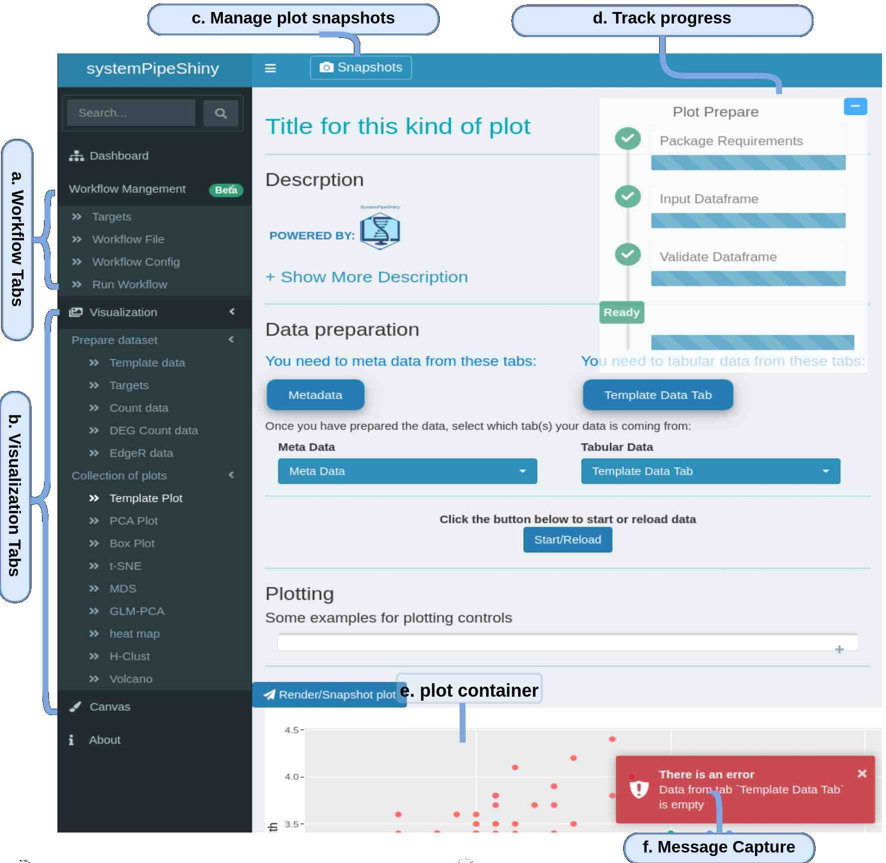
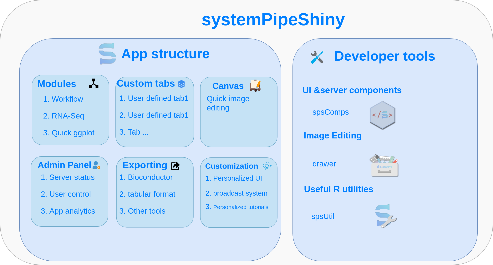
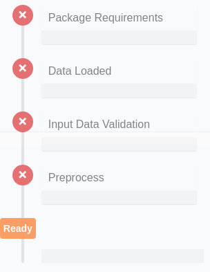
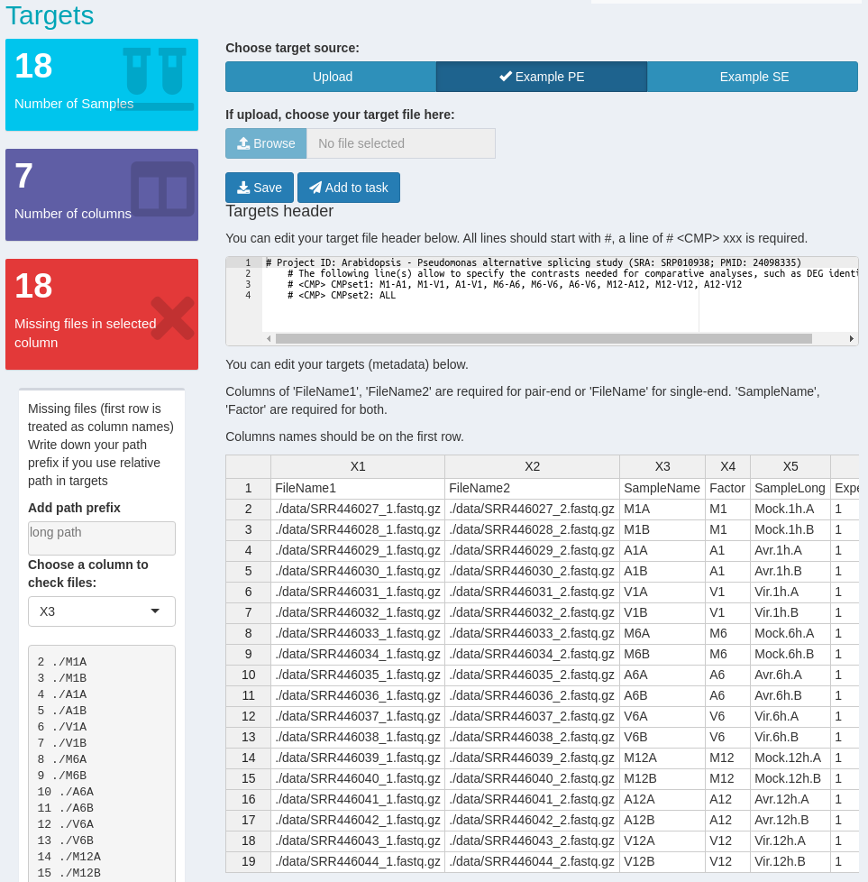
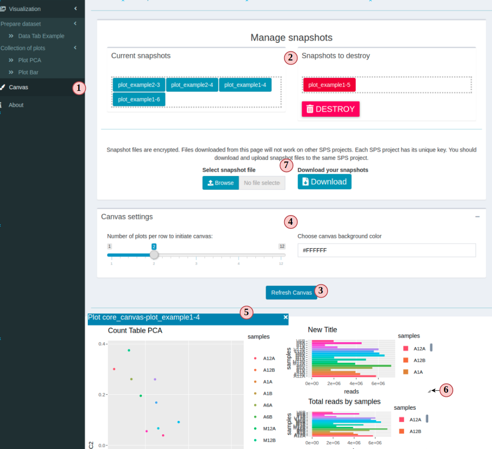

```{css, echo=FALSE, eval=TRUE}
pre code {
white-space: pre !important;
overflow-x: scroll !important;
word-break: keep-all !important;
word-wrap: initial !important;
}
```


```{r style, echo = FALSE, results = 'asis', eval=TRUE}

options(width=60, max.print=1000)
knitr::opts_chunk$set(
    eval=as.logical(Sys.getenv("KNITR_EVAL", "TRUE")),
    cache=as.logical(Sys.getenv("KNITR_CACHE", "TRUE")), 
    tidy.opts=list(width.cutoff=60), tidy=TRUE)
```

```{r setup, echo=FALSE, messages=FALSE, warnings=FALSE, eval=TRUE}
suppressPackageStartupMessages({
    library(systemPipeShiny)
    # library(systemPipeR)
})
htmltools::tagList(rmarkdown::html_dependency_font_awesome())

```

```{r sps-css, results = 'asis', echo=FALSE}
cat("<style>")
readLines(system.file("app/www/css/sps.css", package = "systemPipeShiny")) %>% 
cat(sep = "\n")
cat("</style>")
```


```{r logo, echo=FALSE, out.width='70%', fig.align='center', fig.width=12}
knitr::include_graphics(path = "../inst/app/www/img/sps.png")
```


# Introduction

**<span style="color:#5DA7D6;">s</span>ystem<span style="color:#5DA7D6;">P</span>ipe<span style="color:#5DA7D6;">S</span>hiny**(SPS)
is a [Shiny](https://shiny.rstudio.com/)-based R/Bioconductor package that  has two main purposes: 

 1. To help non-programmers like wet lab researchers on data analysis workflow management and downstream data 
visualizations with a graphical user interface (UI). 
 2. An user friendly framework for both beginners and advanced developers to fast extend 
 with more visualization options(more plot types) and to quickly deploy the app to a Shiny sever. 
 
You can try our demo at [here](https://tgirke.shinyapps.io/systemPipeShiny/). There are 5 
different interactive tutorials embedded on the demo that you can follow(right upper corner). 
Each tutorial covers a major topic of SPS and show how you can interactive with app.

This vignette introduces main features and functionalities of SPS. Due to size limit, 
a full version of users' manual will be later updated at [SytemPipeShiny-book](https://systempipe.org/systemPipeShiny-book/) 
which will include more small demos, screenshots, and *gif* illustrations.

## Install

To install SPS:

```{r, eval=FALSE}
if (!requireNamespace("BiocManager", quietly=TRUE))
    install.packages("BiocManager")
BiocManager::install("systemPipeR/systemPipeShiny", build_vignettes=TRUE, dependencies=TRUE)
```

If you are on Linux, you also need(use Ubuntu as example):

```{bash, eval=FALSE}
sudo apt-get install libv8-dev
sudo apt-get install libssl-dev
sudo apt-get install libcurl4-openssl-dev
```
*libcurl4-openssl-dev* may not be required for Ubuntu >= 18.04.

Depending on the Linux distributions, command can be slightly different. 

## Quick start

Before starting with SPS, you need to create a SPS project: 

```{r spsinit, eval=FALSE}
sps_tmp_dir <- tempdir()
spsInit(dir_path = sps_tmp_dir, change_wd = FALSE)
```
Here for building the vignette we are not switching to the app directory and are using a 
temp directory, in a real case, you **shouldn't** store you SPS project in a **temp directory**.

By default, you will get a folder created under your current working directory, 
the name is `SPS_` + `today's date` in *ISO 8601* format, e.g. 
`r glue::glue("SPS_{format(Sys.time(), '%Y%m%d')}")`

<p style="color:var(--info)">Note: all SPS date or time stamp objects use *ISO 8601* format</p>

By default, your working directory should be set inside that project folder automatically. 
If you are using Rstudio, three main files will be opened for you: `global.R`, `ui.R` and `server.R`. 
Now you can just run the app by type `shiny::runApp()` in console or click on the `Run App`
button on top right corner of the any these 3 files in Rstudio. 
In your global.R, scroll down to the bottom, you should see:


```{r, eval=FALSE}
sps_app <- sps(
    vstabs = "",
    server_expr = {
        msg("Custom expression runs -- Hello World", "GREETING", "green")
    }
)
```

This is the SPS main function. You can load/unload tabs by providing tab IDs in `vstabs` argument, like 
`c("tab1", "tab2)`. See `config/tabs.csv` in your project folder for what tabs IDs can be load and other 
tab information. Currently you can only load/unload visualization tabs, type of *vs*; core tabs(*core*) and 
workflow tabs (*wf*) are loaded automatically. 


# SPS structure
## App directory structure

When a SPS project is created, you would expect the directory contains: 
<pre>
SPS_xx/  
├── server.R               <span class="text-success">|</span> 
├── global.R               <span class="text-success">| Most important server, UI and global files, unless special needs, `global.R` is the only file you need to edit manually</span>   
├── ui.R                   <span class="text-success">|</span>  
├── deploy.R               <span class="text-info">| Deploy helper file</span>  
├── config                 <span class="text-success">| Important app config files. Do not edit them if you don't know</span>  
│   ├── sps.db             
│   ├── sps_options.yaml   
│   └── tabs.csv           
├── data                   <span class="text-primary">| App example data files</span> 
│   ├── xx.csv             
├── R                      <span class="text-primary">| All SPS additional tab files and helper R function files</span> 
│   ├── tab_xx.R            
├── README.md              
├── results                <span class="text-gray">| No in use for this current version, you can store some data been generated from the app</span> 
│   └── README.md          
└── www                    <span class="text-primary">| Internet resources</span>  
    ├── about              <span class="text-gray">| About tab information</span> 
    │   └── xx.md          
    ├── css                <span class="text-info">| CSS files</span>  
    │   └── sps.css         
    ├── img                <span class="text-info">| App image resources</span>    
    │   └── xx.png         
    ├── js                 <span class="text-info">| Javascripts</span>
    │   └── xx.js           
    ├── loading_themes     <span class="text-info">| Loading screen files</span> 
    │   └── xx.html         
    └── plot_list          <span class="text-info">| Image files for plot gallery</span>  
        └── plot_xx.jpg      
</pre>

## App UI structure
SPS provides two core components -- workflow management and data visualization. 
The UI is designed as a dashboard(*Fig 1*). Individual components are classified 
into two categories of tabs (*Fig 1. a-b*).

<center>

**Figure 1. SPS UI**
</center>

The app UI structure can be understand as following(*Fig 2*). Users first need to choose 
either the workflow or visualization part to start with. Workflow part helps users to 
prepare data analysis workflow files in [systemPipeR](http://systempipe.org/)(SPR) format. 
Visualization part helps users to make different types of plots, take interactive snapshot 
of plots and combine/compare different plots on the "Canvas" workbench. 

<center>

**Figure 2. SPS Structure**
</center>

# UI details
## Workflow management 

 Files can be prepared for a data analysis workflow including the metadata(targets) file, workflow 
 step file(Rmarkdown formatted) and a workflow config file. Each of these files are 
 prepared in a SPS tab. You can find them at the left side navigation bar. 
 SPS helps users to check the formats and requirements of each file. Users can click on the
<button type="button" class="btn btn-default">
    <i class="fa fa-paper-plane"></i>
        Add to task
</button> 
button on the page to check for problems. If everything is correct, a 
pop-up messge will show to users or if anything is wrong, a detailed window will 
pop up to indicate errors. 

In the upcomming version of SPS, users can directly run a workflow on the app, but for 
now users need to download these files and copy them to a SPR project and run from 
command line. You can download these files by clicking 
<button  class="btn btn-default">
     <i class="fa fa-download"></i>
     Save
</button>.

<div id="plot_template-pg-pg-container" class="tab-pane" style="padding-left: 130px;">
<div class="control-panel draggable ui-draggable ui-draggable-handle" style="width: 400px; height: auto; background-color: var(--light);">
<div class="row">
<div class="col-sm-1">
</div>
<div class="col-sm-9">
<h5>
Workflow-prepare
</h5>
</div>
<div class="col-sm-2">
<button class="btn btn-default" data-target="#pg-example" data-toggle="collapse" aria-expanded="true">
<i class="fa fa-minus"></i>
</button>
</div>
</div>
<div id="pg-example" class="in collapse" aria-expanded="true" style="">
</img>
</div>
</div>
</div>

A typical workflow tab will look like this one(*Fig3*).

<center>

**Figure 3. Workflow Management**
</center>

## Data Visualization

### Tabs
There are two types of data visualization(VS) tabs: *data tab* and *plot tab*. A data 
tab is where you prepare plotting data, including different preprocess options. 
Depending on the data tab and preprocess options you choose, you will be given different 
plot tab options. 

You should first going to the VS main tab by clicking *<i class="fa fa-images"></i>Visualization*
and read the instructions there.

There are two ways to make a plot:

1. **Begin with a data tab**: If you know have run some data analysis workflows and have obtained results but don't know what you can plot from these results, browse the table on visualization main tab. The table is sorted by workflows as rows. Based on the data type you have, you can click on the data type in the table, you will jump to the corresponding data preparation tab and you will see what plots you can make after data preparation.
2. **Begin with a plot tab**: If you already know what plots you want, there is a gallery on visualization main tab. You can click on the plot you want and it will jump to the plot tab directly. You will see in order to make this plot what input data need to be prepared. By choosing under the **Data Preparation**, you will go to a data tab and once you have prepared the required data, you will be guided back to this plotting tab.

All VS tabs has a start-up button
<button  type="button" class="btn btn-default">Start with this tab</button>
which will first check for packages requirements. If you don't have the required package for 
the tab, there will be a pop-up window telling you how to install the required packages.
In addition to package checks, plot tabs will also check for required plotting data. 
Depending on missing or unqualified data, you will see different error messages on the 
bottom right corner. See [SPS logging](#dual-end-logging) in for more information. 
If everything is good, you will still see a green message and the main tab UI will 
show up and you can continue. 

### Data tabs

Once you have passed the package checks, you should see the data tab main UI. Please 
read the instructions on the top of each tab for how to prepare your data and data 
format requirements. All SPS data tabs comes with an example data set, and if you
are not sure what data to prepare, you can first switch to the example data set and 
play with it. When you are familiar with the tab, you can upload your own data set. 

```{r , echo=FALSE}
HTML('
<div id="df_template-data_source" class="radioGroupButtons shiny-bound-input" style="padding-left: 60px;">
  <div aria-label="..." class="btn-group btn-group-justified btn-group-container-sw" data-toggle="buttons" role="group">
    <div class="btn-group btn-group-toggle" role="group">
      <button class="btn radiobtn btn-default active">
        <input type="radio" autocomplete="off" name="df_template-data_source" value="upload" checked="checked">
        Upload
      </button>
    </div>
    <div class="btn-group btn-group-toggle" role="group">
      <button class="btn radiobtn btn-default">
        <input type="radio" autocomplete="off" name="df_template-data_source" value="eg">
        Example
      </button>
    </div>
  </div>
</div>    
')
```


<p style="color:var(--info)">Note: Upload file selection can be different depending on the mode, see [App options](#app-options)</p>

```{r , echo=FALSE}
HTML('
<div class="input-group" style="width: 30%; padding-left: 60px">
  <label class="input-group-btn input-group-prepend">
    <span class="btn btn-file btn-default">
      Browse
      <input id="df_template-file_upload" name="df_template-file_upload" type="file" style="display: none;">
    </span>
  </label>
  <input type="text" class="form-control" placeholder="No file selected" readonly="readonly">
</div>
')
```

### Plot tabs


## Snapshot and Canvas

<center>

**Figure 4. Canvas**
</center>

# Configuration
# Features

## User friendly

SPS is easy to use for people different backgrounds. The GUI operations require no
programming experience. Detailed design templates are provided for advanced users allowing them to add new
features(tabs) to SPS.

## Dual-end logging

Messages, warnings and errors from R functions are automatically captured and logged on
both the server and client ends. The corresponding information can be displayed in a message box.

## Progress tracking

A progress tracking panel is provided on each tab to notify users about run status.

## App options

a robust exception handling system has been implemented (similar to Shiny options), that
provides error solutions to to users, e.g. invalid parameter settings.
    - upload options
    
## Modular isolation

SPS is built on Shiny modules, which provides local scope isolation between each tab.
Objects on one tab do not conflict with other tabs. They work like individual posts 
in a forum. To enable cross-tab communication, SPS also supports global scope interactions.
## A variety of additional shiny widgets: There are many useful HTML components that 
can be use outside out SPS. You can include these widgets in your own Shiny apps without 
loading SPS main framework. 

## Canvas

Under this workbench users can take snapshots of different plots, and combine or resize them. This
feature is useful for generating complex scientific summary graphics.

### systemPipeShiny

Shiny Web Interface
Shiny application for interactive workflow management and results visualization generated by *systemPipeR*


# Setting up the data

# Launching the application

# Description of the user interface
## dashboard
## layout 
## each tab
## Workflow Management system
# Description of *systemPipeShiny* functionality
# SPS configurations
## the config folder
## SPS options
## SPS tab
## SPS database
# For developers
## Tab control
### Tab classification
### New data tab
### New plot tab
### Load new tab to the framework
### Remove a tab
### a Empty tab for advanced devleopers
## 


## Visualization 

*systemPipeShiny* offers interactive data visualization to users and supports graphics in workflow reports. In systemPipeShiny's visualization tab, there are many features for data visualization of various statistical results. Users can upload different input data types, and apply various options for preprocessing those datasets. Users can then create downstream analysis plots, as per the type of uploaded data. Some available plotting options include: bar plots of differentially expressed genes, heat maps, dendrogram, principal component analysis (PCA) plots, and multidimensional scaling (MDS) plots. Depending on the nature of the plots, there are also options to adjust the plot such as normalizing the data. Additionally, systemPipeShiny provides users with plot templates and plotting functions that they can then customize according to their necessities for visualization.

Table with all exported functions

| Function Name   | Description                                                     |
|-----------------|-----------------------------------------------------------------|
| `exploreDSS`    | Transform raw read counts using the \code{DESeq2} package       |
| `plotExploreDSS`| Scatterplot of transformed counts from two samples              |
| `plotPCA_sps`   | Plots PCA from a count matrix                                   |
| `plotMDS`       | Plots MDS from a count matrix                                   |
| `plotTSNE`      | Plots t-SNE from a count matrix                                 |
| `plotGLM`       | Plots GLM-PCA from a count matrix                               |
| `plotHeatMap`   | Plots Heatmap from a count matrix                               |
| `plot_MA`       | Plots a clustering dendrogram from a count matrix               |
| `run_volcano`   | Plots a Volcano Plot from an edgeR or deseq2 dataframe          |
| `deg_edgeR`     | Plots barplot of DEGs from a count matrix, returns an edgeR DF  |
| `deg_deseq2`    | Plots barplot of DEGs from a count matrix, returns an deseq2 DF |

### Data transformations and visualization

To show the effect of the transformation, in the figure below we plot the first sample against the second, first simply using the `log2` function, and then using the `VST` and `rlog-transformed` values. For the log2 approach, we need to first estimate size factors to account for sequencing depth, and then specify `normalized=TRUE`. Sequencing depth correction is done automatically for the `vst` and `rlog.`

```{r, eval=FALSE}
targetspath <- system.file("extdata", "targets.txt", package="systemPipeR")
targets <- read.delim(targetspath, comment="#")
cmp <- systemPipeR::readComp(file=targetspath, format="matrix", delim="-")
countMatrixPath <- system.file("extdata", "countDFeByg.xls", package="systemPipeR")
countMatrix <- read.delim(countMatrixPath, row.names=1)
plot.exploreDDS(countMatrix, targets, cmp = cmp[[1]], preFilter = 10, sample = c(3,4))
```

## Barplot

A barplot for analysis of differentially expressed genes (DEGs) can be plotted using functions `deg_edgeR` or `deg_deseq2`. The function `deg_edgeR` uses the `edgeR` package [@Robinson2010-uk] to create an `edgeR` data frame. Alternatively, the function `deg_deseq2` uses the `DESeq2` package [@Love2014-sh] to create an `DESeq2` data frame. Using the `filterDEGs` function, it filters and plots DEG results for up and down regulated genes in a barplot. 

## Heatmap

A heatmap of the results of hierarchical clustering performed with the `hclust` function can be created with the `run_HEAT` function. The sample-wise Spearman correlation coefficients are computed before hierarchical clustering. The count data frame can be transformed with the `rlog` or Variance-stabilizing Transformation (`vst`) methods from the `DESeq2` package, or can be done without transformation. 

## Dendrogram

A dendrogram of the results of hierarchical clustering performed with the `hclust` function can be created with the `run_CLUST` function. The sample-wise Spearman correlation coefficients are computed, and then the results are transformed to a distance matrix before the hierarchical clustering is performed. The count data frame can be transformed with the `rlog` or Variance-stabilizing Transformation (`vst`) methods from the `DESeq2` package, or can be done without transformation. 

## t-SNE plot

A Barnes-Hut t-Distributed Stochastic Neighbor Embedding (t-SNE) plot can be created using the `run_TSNE` function, which uses the `Rtsne` package [@Krijthe2015] to compute t-SNE values. The function removes duplicates in the input data frame, sets a seed for reproducility, performs an initial PCA step. The function also allows for a user-set perplexity value for the computation. 

## PCA plot

A Principal Component Analysis (PCA) plot can be created using the `run_PCA` function which uses the `DESeq2` package. The input data frame can be transformed with the `rlog` or Variance-stabilizing Transformation (`vst`) methods from the `DESeq2` package, or can be done without transformation. 
In addition, generalized principal component analysis (GLM-PCA) for dimension reduction of non-normally distributed data can be plotted with the `run_GLM` function [@Townes2019]. This option does not offer transformation or normalization of raw data.

## MDS plot

A Multidimensional Scaling (MDS) plot can be created using the `run_MDS` function.  The input data frame can be transformed with either the `rlog` or Variance-stabilizing Transformation (`vst`) methods from the `DESeq2` package. From the input data, it computes a spearman correlation-based distance matrix and performs MDS analysis on it.

## Volcano plot

A volcano plot of DEGs data frame can be plotted using the function `run_volcano`. Using the resulting data frame from `run_edgeR` or `run_deseq2`, the function plots a volcano plot using False Discovery Rate and Log Fold Change thresholds for the sample comparison specified by the user.

# How to use this function on the Shiny application

# How to custom the Visualization Tab

# For developers
  
## Coventions for this app

### 1. App structure
1. Directories:
    1. config: config files
    2. data: example datasets 
    3. results: not in use for now but users can store data generated from the app
    3. R: all functions, tabs. This folder will be automatically sourced
    4. www: html web resources, will be treated as root of frontend resources
    
Each folder has a README.md. You can know more information by reading that file. 

### 2. Important files    
1. Three big files in the main directory:
    - **global.R**: all sourcing, load library, global variables.
    - **server.R**: top level server function, automatically generated by `sps()`.
    - **ui.R**: top level UI, automatically generated by `sps()`.

All you need is to change code in `global`

### 3. Naming
1. tabs:
    - All store in `R` folder;
    - All should be named as `tab_xx.R`; if a submodule contains submodule. If 
    this tab is a sub tab, name it `tab_type_id.R`, e.g. a tab for 
    visualization new data type will be `tab_vs_data_xxx.R`, a new plot tab will be 
    `tab_vs_plot_xxx.R`.
    - All tab info should also be updated in `tabs.csv` as the tab metadata.
        - visualization data tabs should hava tab name as `data_xx`, plot tab 
        should be `plot_xx`
    
2. functions:
    - in each *tab* file, there should be one `UI` function and one `server` 
    function and give both functions and name space the same ID as the file name: 
    e.g. a file named `tab_sub1.R`, UI function will be `sub1UI`, server will be 
    `sub1Server` and in top level UI and server call them `sub1UI("sub1", ...)`, 
    `callModule(tab1Server, "tab1", ...)`.

## 4. Standard for visualization
1. Plots
    - In princple, datasets should be plotting ready (no need to preprocess data). 
    - For some plots that are very specific to some workflows, simple preprocess is okay.
    - Always use a button to update (re-plot) the graph, realtime rendering can be expensive. 

## 5. Objects saved in `shared`

"Shared" is first defined in the top level server as a shiny `ReactiveValues` object to hold data that can
be passed around tabs(modules). This is very important if you want to transfer like a 
dataframe from df tabs to plotting tabs. 

To access values in `shared`, use `$` or `[['name']]`, e.g. `shared$xxx$subxxx` or `shared[['xxx']][['subxxx']]`.

### default stored objects

- wf_flags: bool values to indicate required files status for the workflow
    - targets_ready, wf_ready, wf_conf_ready: target file, workflow Rmd file, config yaml file
    
- targets: targets file
    - df: dataframe, which will be used to display from top push bar
    - file: string, the temp path of edited targets. When `add to task` is clicked and 
    check passed, this file will be write to temp with **target header**
    
- count: count table
    - df, file: same as targets
    
- config: configuration yaml file
    - file: same as targets

# How to deploy the application

# Version Information

```{r sessionInfo, eval=TRUE}
sessionInfo()
```

# Funding

# References
